# PharmaChain — System Architecture Diagram (Mermaid.js Specification)

This document contains the official, valid, and fully-specified **Mermaid.js architecture diagram** for **PharmaChain (SIH 2026)**.

You can render this diagram directly in:
- **PowerPoint** (via the Mermaid Preview add-in or by copying the pre-rendered PNG)
- **GitHub Markdown**
- **Notion / Obsidian**
- **[Mermaid Live Editor](https://mermaid.live)**

---

## Architecture Diagram (Mermaid Preview)

```mermaid
flowchart TD
    %% Styling Classes
    classDef clientStyle fill:#EFF6FF,stroke:#2563EB,stroke-width:2px,color:#0F172A,rx:8;
    classDef gatewayStyle fill:#FFFBEB,stroke:#F59E0B,stroke-width:2px,color:#0F172A,rx:8;
    classDef microStyle fill:#F0FDF4,stroke:#10B981,stroke-width:2px,color:#0F172A,rx:8;
    classDef storeStyle fill:#F8FAFC,stroke:#64748B,stroke-width:1.5px,color:#0F172A,rx:6;
    classDef cryptoStyle fill:#FEF2F2,stroke:#DC2626,stroke-width:2px,color:#991B1B,rx:8;
    classDef aiStyle fill:#FAF5FF,stroke:#8B5CF6,stroke-width:2px,color:#5B21B6,rx:8;
    classDef ledgerStyle fill:#F0FDFA,stroke:#0D9488,stroke-width:2px,color:#0F172A,rx:8;
    classDef fabricStyle fill:#ECFDF5,stroke:#059669,stroke-width:2px,color:#047857,rx:8;
    classDef couchStyle fill:#F8FAFC,stroke:#475569,stroke-width:2px,color:#0F172A,rx:8;

    %% ==========================================
    %% TIER 1: CLIENT APPLICATIONS & SCANNING
    %% ==========================================
    subgraph T1 ["1. CLIENT APPLICATIONS & PHYSICAL SCANNING LAYER"]
        direction LR
        MFG_WEB["🏭 <b>Manufacturer Portal</b><br/>React 19 • Tailwind CSS • Vite<br/>51 CDSCO Fields • Live Mint"]:::clientStyle
        CHEMIST_POS["📱 <b>Chemist POS Scanner</b><br/>React Native • Expo • NativeWind<br/>Shipper Intake • Retail Sale"]:::clientStyle
        CITIZEN_PWA["🔍 <b>Citizen Verifier App</b><br/>React Native & Zero-Install PWA<br/>Camera Scan • 0-100 Trust Score"]:::clientStyle
        CDSCO_GOV["🏛️ <b>CDSCO Admin Portal</b><br/>Regulatory Dashboard<br/>&lt;100ms Recall Kill-Switch"]:::clientStyle
        FACTORY_LINE["🖨️ <b>Packaging Hardware</b><br/>Domino / Videojet Printers<br/>Direct 2D DataMatrix Etch"]:::clientStyle
    end

    %% ==========================================
    %% TIER 2: CLOUD INGRESS & ROUTING
    %% ==========================================
    subgraph T2 ["2. CLOUD INGRESS & API GATEWAY ROUTING"]
        direction LR
        CDN["☁️ <b>AWS CloudFront CDN</b><br/>Global Edge SSL Termination • Web Bundles"]:::gatewayStyle
        INGRESS["🛡️ <b>NGINX Kubernetes Ingress Controller</b><br/>Path Routing • Rate Limiting • DDoS Guard • TLS Termination"]:::gatewayStyle
    end

    %% ==========================================
    %% TIER 3: KUBERNETES MICROSERVICES & OFF-CHAIN DATA
    %% ==========================================
    subgraph T3 ["3. KUBERNETES MICROSERVICES & STORAGE LAYER"]
        direction LR
        subgraph COL_MFG ["Manufacturing Column"]
            direction TB
            SRV_MFG["⚙️ <b>manufacturer-service (:3001)</b><br/>Node.js 20 • Express • JWT<br/>Async 100k Mint Worker (HTTP 202)"]:::microStyle
            DB_S3[("🪣 <b>AWS S3 Storage</b><br/>100k Presigned CSVs & Manifests")]:::storeStyle
            SRV_MFG --> DB_S3
        end

        subgraph COL_SHOP ["Chemist POS Column"]
            direction TB
            SRV_SHOP["🏪 <b>shopkeeper-service (:3002)</b><br/>Node.js 20 • Drug License Gate<br/>Wholesale Intake Guard • POS Sale Decrement"]:::microStyle
            DB_MONGO[("🍃 <b>MongoDB Document Store</b><br/>Off-Chain Inventory & Custody Logs")]:::storeStyle
            SRV_SHOP --> DB_MONGO
        end

        subgraph COL_CONS ["Citizen Verification Column"]
            direction TB
            SRV_CONS["🛡️ <b>consumer-service (:3003)</b><br/>Zero-Trust Verification Engine<br/>7 Lifecycle States • Trust Score (0-100)"]:::microStyle
            DB_REDIS[("⚡ <b>Redis Cache</b><br/>Sub-ms Scan Cache & Key Ring")]:::storeStyle
            SRV_CONS --> DB_REDIS
        end

        subgraph COL_ADM ["Regulatory Admin Column"]
            direction TB
            SRV_ADM["⚖️ <b>admin-service (:3005)</b><br/>CDSCO Governance Controller<br/>Nationwide Recall Lock • Telemetry Feeds"]:::microStyle
            DB_STREAM[("📡 <b>Audit & Incident Stream</b><br/>Redis Streams • Event Queue for AI")]:::storeStyle
            SRV_ADM --> DB_STREAM
        end
    end

    %% ==========================================
    %% TIER 4: CRYPTO TRUST ROOT & AI ENGINE
    %% ==========================================
    subgraph T4 ["4. CRYPTOGRAPHIC TRUST ROOT & AI/ML INTELLIGENCE LAYER"]
        direction LR
        subgraph VAULT ["🔒 pharma-core (:4000) — Central Cryptographic Trust Root"]
            direction TB
            P256["🔑 <b>ECDSA NIST P-256</b><br/>In-Memory 5k in 518ms (~0.104ms/pack)<br/>Ephemeral Key Burning"]:::cryptoStyle
            AES["🛡️ <b>AES-256-GCM Vault</b><br/>Master Keystore • scrypt KDF<br/>Promise-Chain Mutex (Zero Corruption)"]:::cryptoStyle
            JWKS["🌐 <b>RFC 7517 JWKS Endpoint</b><br/>/.well-known/jwks.json<br/>Zero-Roundtrip Offline Client Verify"]:::cryptoStyle
            BITMAP["⚡ <b>O(1) Bit-Array State</b><br/>50MB → 12.5KB Merkle Leaves<br/>Sub-ms Duplicate & Status Lookup"]:::cryptoStyle
        end

        subgraph AI_CORE ["🤖 AI, ML & GenAI Layer (FastAPI & Python 3.11)"]
            direction TB
            MISTRAL["🧠 <b>Mistral AI (LLM)</b><br/>mistral-embed Vector Embeddings<br/>ADR Clinical Triage & Regulatory Summaries"]:::aiStyle
            LANGGRAPH["🔄 <b>LangGraph Multi-Agent</b><br/>Cyclical State Decision Graph<br/>Autonomous Recall Triage & Supervisor"]:::aiStyle
            PINECONE["🌲 <b>Pinecone Vector DB</b><br/>High-Dim Semantic Search<br/>Complaint Clustering & Counterfeit Matching"]:::aiStyle
            ML_DRIFT["📈 <b>Predictive ML & Drift Engine</b><br/>Isolation Forest (Velocity) • DBSCAN Clusters<br/>SciPy Z-Score & PSI Drift Detection"]:::aiStyle
        end
    end

    %% ==========================================
    %% TIER 5: PERMISSIONED BLOCKCHAIN LEDGER
    %% ==========================================
    subgraph T5 ["5. PERMISSIONED BLOCKCHAIN DISTRIBUTED LEDGER"]
        direction LR
        GATEWAY["☕ <b>Spring Boot 4.1 Fabric Gateway (:8080)</b><br/>Java 17 • Fabric Gateway Java SDK • Mutual TLS (mTLS)<br/>250 Tx Batch Blocks • Channel Multiplexing • Failover"]:::ledgerStyle
        FABRIC["⛓️ <b>Hyperledger Fabric v2.5 LTS Consortium</b><br/>3 Raft Orderers • 4 Endorsing Orgs (Mfg, CDSCO, Chemist, Audit)<br/><b>pharmacc.jar (Java Chaincode)</b><br/>:MINTED → :INTAKE / AT_SHOP → :SOLD → :RECALLED"]:::fabricStyle
        COUCHDB[("🗄️ <b>CouchDB World State Database (:5984)</b><br/>Composite Key: packHash:MFG / packHash:SHOP<br/>Mango JSON Query Indexes • Instant Double-Spend Lock")]:::couchStyle
    end

    %% ==========================================
    %% TIER 6: NUMBERED LIFECYCLE WORKFLOW
    %% ==========================================
    subgraph T6 ["6. CORE CRYPTOGRAPHIC & OPERATIONAL VERIFICATION LIFECYCLE (END-TO-END)"]
        direction LR
        STEP1["<b>1. Batch Serialization</b><br/>Mfg enters 51 fields<br/>pharma-core signs in-memory<br/>Burns key & exports S3 CSV"]:::clientStyle
        STEP2["<b>2. Ledger Mint Commit</b><br/>Gateway batches 250 tx/block<br/>Init O(1) Bitmaps<br/>Fabric consensus commit"]:::ledgerStyle
        STEP3["<b>3. Wholesale Intake</b><br/>Chemist scans carton<br/>Gateway verifies ECDSA<br/>INTAKE / AT_SHOP on-chain"]:::microStyle
        STEP4["<b>4. Retail POS Checkout</b><br/>Chemist scans blister strip<br/>Validates custodian<br/>SOLD committed (no double-spend)"]:::gatewayStyle
        STEP5["<b>5. Citizen Scan & AI Triage</b><br/>Patient camera scans QR<br/>Offline JWKS verify (0-100 Score)<br/>Mistral/LangGraph Triage"]:::aiStyle
        STEP1 ==> STEP2 ==> STEP3 ==> STEP4 ==> STEP5
    end

    %% ==========================================
    %% INTER-TIER CONNECTORS
    %% ==========================================
    MFG_WEB -->|"HTTPS REST"| INGRESS
    CHEMIST_POS -->|"REST / mTLS"| INGRESS
    CITIZEN_PWA -->|"Zero-Trust Scan"| INGRESS
    CDSCO_GOV -->|"Admin API"| INGRESS
    FACTORY_LINE -.->|"Etches Blister 2D Matrix"| MFG_WEB

    CDN -.-> INGRESS

    INGRESS -->|"/api/manufacturer/*"| SRV_MFG
    INGRESS -->|"/api/shopkeeper/*"| SRV_SHOP
    INGRESS -->|"/api/consumer/*"| SRV_CONS
    INGRESS -->|"/api/admin/*"| SRV_ADM

    SRV_MFG -->|"Sign Batch (P-256)"| P256
    SRV_SHOP -->|"JWKS Verify"| JWKS
    SRV_CONS -->|"JWKS Public Key"| JWKS
    SRV_CONS -->|"Telemetry & ADR Complaints"| MISTRAL
    SRV_ADM -->|"Recall Triage & Telemetry"| LANGGRAPH

    P256 -->|"Signed Payload Transitions (mTLS)"| GATEWAY
    GATEWAY -->|"250 Tx / Block (gRPC)"| FABRIC
    FABRIC -->|"State Commit & Mango Index"| COUCHDB

    LANGGRAPH -.->|"Automated Recall Trigger"| GATEWAY

```

---

## Architectural Highlights

1. **Tier 1: Client Applications & Physical Scanning Layer**:
   - **Manufacturer Web Portal**: React 19, Tailwind CSS, Vite, 51 statutory fields, S3 manifest CSV streaming.
   - **Chemist POS Scanner App**: React Native, Expo, NativeWind, high-speed camera scanner, wholesale intake & retail checkout.
   - **Citizen Verification App**: React Native & Zero-Install PWA, camera instant scan, sub-20ms 0–100 Trust Score, ADR clinical intake.
   - **CDSCO Regulatory Portal**: Government admin surveillance dashboard, &lt;100ms emergency batch recall kill-switch.
   - **Factory Packaging Line**: Domino / Videojet industrial laser printers etching 2D DataMatrix directly onto blister strips.

2. **Tier 2: Cloud Ingress & Routing Gateway**:
   - **AWS CloudFront**: Edge SSL termination and caching for static web bundles.
   - **NGINX Kubernetes Ingress Controller**: Path-based microservice routing, rate limiting, and DDoS mitigation.

3. **Tier 3: Kubernetes Microservices & Storage Layer**:
   - **`manufacturer-service` (:3001)** $\to$ **AWS S3**: 100k-pack asynchronous mint worker, manifest CSV streaming.
   - **`shopkeeper-service` (:3002)** $\to$ **MongoDB**: Wholesale intake duplicate lock, retail POS stock decrement.
   - **`consumer-service` (:3003)** $\to$ **Redis Cache**: Zero-trust public verification engine, 7 verification states.
   - **`admin-service` (:3005)** $\to$ **Audit & Incident Stream**: CDSCO nationwide recall lock, supply integrity telemetry.

4. **Tier 4: Cryptographic Trust Root & AI Intelligence Layer**:
   - **`pharma-core` (:4000)**: ECDSA NIST P-256 in-memory signing (5,000 packs in 518ms), AES-256-GCM vault, RFC 7517 JWKS discovery, and $O(1)$ compressed Merkle bit-arrays (50 MB $\to$ 12.5 KB).
   - **AI, ML & GenAI Layer (FastAPI & Python 3.11)**: Mistral AI (LLM & `mistral-embed`), LangGraph multi-agent cyclical state machine, Pinecone vector search, scikit-learn Isolation Forest (velocity anomalies), DBSCAN geospatial clustering, and SciPy PSI drift detection.

5. **Tier 5: Permissioned Blockchain Distributed Ledger**:
   - **Spring Boot 4.1 Fabric Gateway (:8080)**: Java 17, Fabric Gateway SDK, mTLS, 250 tx/block batching, gRPC multiplexing.
   - **Hyperledger Fabric v2.5 LTS**: 3 Raft ordering nodes, 4 endorsing orgs, Java Chaincode (`pharmacc.jar`), Private Data Collections (PDC).
   - **CouchDB World State (:5984)**: Key-value schema (`packHash:MFG`, `packHash:SHOP`), Mango queries, zero-storage double-spend lock.

6. **Tier 6: End-to-End Verification Lifecycle**:
   - 1. Batch Serialization $\to$ 2. Ledger Mint Commit $\to$ 3. Wholesale Chemist Intake $\to$ 4. Retail POS Sale $\to$ 5. Citizen Scan & AI Triage.
