# 💊 PharmaChain: Unified Architecture & Production Pipeline Specification (V2.1 Hardened)
### Smart India Hackathon (SIH 2026) | National Cryptographic Drug Provenance Infrastructure
**Document Version:** `2.1.0-PRODUCTION` | **Date:** September 2026 | **Scale:** Trillion-Pack Ready  
**Status:** 🟢 Validated & Fully Tested (16/16 Integration Tests Passing)

---

## 📑 Table of Contents

1. [Executive Summary & Core Architectural Tenets](#1-executive-summary--core-architectural-tenets)
2. [Mathematical & Cryptographic Foundations](#2-mathematical--cryptographic-foundations)
   - [2.1 The 4-Bit Nibble State Map (Zero-Row Scalability)](#21-the-4-bit-nibble-state-map-zero-row-scalability)
   - [2.2 Ephemeral ECDSA NIST P-256 with Perfect Forward Secrecy (PFS)](#22-ephemeral-ecdsa-nist-p-256-with-perfect-forward-secrecy-pfs)
   - [2.3 Feistel 30-Bit Balanced Permutation Cipher](#23-feistel-30-bit-balanced-permutation-cipher)
   - [2.4 Compact QR Payload Structure](#24-compact-qr-payload-structure)
3. [The Four Core Guarantees](#3-the-four-core-guarantees)
   - [3.1 Blockchain First Principle (Zero Orphaned State)](#31-blockchain-first-principle-zero-orphaned-state)
   - [3.2 Deterministic Consensus Timestamping](#32-deterministic-consensus-timestamping)
   - [3.3 Comprehensive Forensic Custody Recording](#33-comprehensive-forensic-custody-recording)
   - [3.4 Automated Origin Attribution for Counterfeit Clones](#34-automated-origin-attribution-for-counterfeit-clones)
4. [State Machine Specification & Transition Matrix](#4-state-machine-specification--transition-matrix)
5. [System Architecture & Network Topology](#5-system-architecture--network-topology)
6. [Complete Step-by-Step Dry Run (Batch of 10 Packs)](#6-complete-step-by-step-dry-run-batch-of-10-packs)
   - [Phase 1: In-RAM Ephemeral Signing & Blockchain Commitment](#phase-1-in-ram-ephemeral-signing--blockchain-commitment)
   - [Phase 2: S3 Artifact Generation & Authoritative Database Commit](#phase-2-s3-artifact-generation--authoritative-database-commit)
   - [Phase 3: Factory Floor Dispatch & Bulk Minting](#phase-3-factory-floor-dispatch--bulk-minting)
   - [Phase 4: Pharmacy Intake (`AT_SHOP`) & Custody Stamping](#phase-4-pharmacy-intake-at_shop--custody-stamping)
   - [Phase 5: Point-of-Sale Dispense (`SOLD`) & Seller Stamping](#phase-5-point-of-sale-dispense-sold--seller-stamping)
   - [Phase 6: Citizen Authenticity Verification (Legitimate Sale)](#phase-6-citizen-authenticity-verification-legitimate-sale)
   - [Phase 7: Supply-Chain Diversion Scenario (Warehouse Theft)](#phase-7-supply-chain-diversion-scenario-warehouse-theft)
   - [Phase 8: Counterfeit Photocopy / Clone Detection & Forensic Attribution](#phase-8-counterfeit-photocopy--clone-detection--forensic-attribution)
   - [Phase 9: Emergency CDSCO National Recall (Instant O(1) Kill-Switch)](#phase-9-emergency-cdsco-national-recall-instant-o1-kill-switch)
7. [World State Ledger Layout & Storage Footprint](#7-world-state-ledger-layout--storage-footprint)
8. [Automated Test Suite & Verification Proof](#8-automated-test-suite--verification-proof)

---

## 1. Executive Summary & Core Architectural Tenets

India suffers an estimated **₹40,000+ Crore annual shadow economy** in counterfeit, adulterated, and gray-market pharmaceuticals. Traditional serialized 1D/2D barcodes fail due to the **"Dumb QR Code" flaw**: a malicious actor buys one authentic medicine blister, photocopies its QR code 10,000 times, and adheres them to counterfeit packaging.

PharmaChain resolves this problem with an unforgeable, high-throughput cryptographic infrastructure:

```
┌────────────────────────────────────────────────────────────────────────────────────────┐
│                               PHARMACHAIN V2.1 PARADIGM                                │
├───────────────────────────────┬────────────────────────────────────────────────────────┤
│ Zero Per-Pack DB Rows         │ O(1) storage overhead via dense 4-bit nibble bitmaps   │
│ Ephemeral Key PFS             │ Private keys exist in RAM for ~50ms, then destroyed    │
│ Blockchain First              │ Fabric consensus commits BEFORE S3 or MongoDB writes   │
│ Consensus Clock Isolation     │ Timestamps derive from Fabric Raft, not client clocks  │
│ Forensic Custody Tracking     │ Immutable shopId, sellerId, operatorId, and GPS coords │
│ Replay / Clone Attribution    │ Duplicate scans expose the original selling pharmacy   │
│ Diversion Immunity            │ Packs cannot be sold without verified pharmacy intake  │
└───────────────────────────────┴────────────────────────────────────────────────────────┘
```

---

## 2. Mathematical & Cryptographic Foundations

### 2.1 The 4-Bit Nibble State Map (Zero-Row Scalability)

To track every unit blister across national supply chains without inflating relational databases or blockchain states with billions of rows, PharmaChain packs the lifecycle state into **4 bits (1 nibble = 2 packs per byte)**:

$$\text{Total Storage Bytes} = \left\lceil \frac{\text{Total Quantity}}{2} \right\rceil$$

```
Byte 0b[High Nibble: Pack i+1][Low Nibble: Pack i]
```

#### State Definitions:
* `0x0` — `CREATED`: Batch allocated; packs signed; waiting in factory storage.
* `0x1` — `MINTED`: Cartons physically shipped; active in wholesale transit.
* `0x2` — `AT_SHOP`: Verified and checked into a licensed pharmacy's inventory.
* `0x3` — `SOLD`: Dispensed to a patient at the billing counter.
* `0x4` — `REVOKED`: Blocked by regulatory recall or safety quarantine.

#### Real-World Scale Footprint:
* **Batch of 10 packs**: $5\text{ bytes}$
* **Commercial Batch (100,000 packs)**: $50\text{ KB}$
* **National Fleet (1,000,000,000 packs)**: $500\text{ MB}$ total blockchain state!

---

### 2.2 Ephemeral ECDSA NIST P-256 with Perfect Forward Secrecy (PFS)

Instead of using a static manufacturer master key that risks catastrophic compromise:
1. Every batch generates a fresh **NIST P-256 (prime256v1) elliptic curve keypair** in volatile memory (RAM).
2. All $N$ packs are signed using `ES256` in parallel.
3. The Public Key is anchored immutably on the Hyperledger Fabric ledger: `<batchId>:PUBKEY`.
4. The Private Key is **cryptographically scrubbed** from memory via `crypto.randomFillSync()`.

$$\text{Post-Scrub State: } \Pr[\text{Forging Pack } N+1] \le 2^{-256}$$

---

### 2.3 Feistel 30-Bit Balanced Permutation Cipher

Batch IDs are rendered compact, URL-safe, and non-sequential via a 4-round Feistel permutation over a 30-bit domain ($2^{30} = 1,073,741,824$ unique batch IDs):

$$L_{i+1} = R_i$$
$$R_{i+1} = L_i \oplus F(R_i, K_i)$$

Where the round function $F$ utilizes MurmurHash3 / 64-bit integer mix functions. The resulting 30-bit integer maps bijectively to a 6-character Base62 string (e.g., `X7K2M9QR`).

---

### 2.4 Compact QR Payload Structure

To minimize QR code density for high-speed scanning on low-cost smartphone cameras, the URL contains a compact JWT:

```
https://pharmachain.gov.in/v?t=eyJhbGciOiJFUzI1NiJ9.eyJiIjoiUEMtQkFUQ0gtTVJDSVBMLTIwMjYwOTEwLTdEM0ExRiIsImkiOjAsIm4iOjI3NTEzNDUzNDV9.MEQCIDe...
```

* `b`: System Batch ID (`PC-BATCH-MRCIPL-20260910-7D3A1F`)
* `i`: Sequential pack index ($0 \le i < \text{totalQuantity}$)
* `n`: 32-bit CSPRNG Nonce (prevents rainbow table and token enumeration attacks)

---

## 3. The Four Core Guarantees

```mermaid
flowchart TD
    subgraph S1["Phase 1: Blockchain First"]
        A["pharma-core RAM Sign"] --> B["Fabric: initBatchScanMap"]
        B -- Error --> B_Fail["Abort 502 / Zero DB Writes"]
        B -- Success --> C["Stream CSV to S3"]
        C --> D["Burn Ephemeral Key in RAM"]
        D --> E["MongoDB Batch.create()"]
    end

    subgraph S2["Phase 2: Supply Chain Ingestion"]
        F["Factory Dispatch"] --> G["Fabric: mintBatch (CREATED -> MINTED)"]
        G --> H["Pharmacy Intake"]
        H --> I["Fabric: setPackState (MINTED -> AT_SHOP)"]
        I --> J["Write Custody Record: <batchId>:PACK:i:INTAKE"]
    end

    subgraph S3["Phase 3: Point of Sale"]
        K["POS Scan"] --> L["Fabric: setPackState (AT_SHOP -> SOLD)"]
        L --> M["Write Custody Record: <batchId>:PACK:i:SOLD"]
    end

    subgraph S4["Phase 4: Forensics & Citizens"]
        N["Citizen Scan"] --> O["Query Fabric Nibble State & Custody"]
        P["Counterfeit Rescan"] --> Q["Fabric ALREADY_SOLD + originalSaleCustody"]
    end
```



### 3.1 Blockchain First Principle (Zero Orphaned State)
In traditional architectures, databases write first and blockchain commits later, leading to phantom records if the ledger fails. In PharmaChain:
1. Hyperledger Fabric executes and commits **FIRST**.
2. If Fabric rejects or encounters Raft consensus failure, the pipeline terminates immediately with HTTP 502.
3. S3 CSV manifests are uploaded **SECOND**.
4. MongoDB writes the `Batch` document **THIRD and LAST**.

### 3.2 Deterministic Consensus Timestamping
Client device clocks can be spoofed or unsynchronized. All state timestamps (`intakeTimestamp`, `sellTimestamp`) are derived strictly from:
```java
Instant consensusTime = ctx.getStub().getTxTimestamp();
```
This guarantees complete immunity against device clock manipulation.

### 3.3 Comprehensive Forensic Custody Recording
Whenever a pack is intaked or sold, the transaction layer writes a lightweight, permanent custody certificate:
* `<batchId>:PACK:<packIndex>:INTAKE`: Stores `intakeShopId`, `intakeOperatorId`, `location`, and `intakeTimestamp`.
* `<batchId>:PACK:<packIndex>:SOLD`: Stores `sellerId`, `soldByOperator`, `location`, and `sellTimestamp`.

### 3.4 Automated Origin Attribution for Counterfeit Clones
When an attacker scans a duplicated QR code at a point of sale:
1. Fabric detects the current state is already `0x3 (SOLD)`.
2. The chaincode loads the existing `<batchId>:PACK:<index>:SOLD` record.
3. The transaction rejects with `ALREADY_SOLD` and embeds `originalSaleCustody`.
4. Regulators receive the exact store ID, operator, and timestamp of the legitimate original sale vs. the fraudulent clone attempt.

---

## 4. State Machine Specification & Transition Matrix

```
                      ┌───────────────┐
                      │  0x0 CREATED  │
                      └───────┬───────┘
                              │
                    Factory Dispatch (mintBatch)
                              │
                              ▼
                      ┌───────────────┐
                      │  0x1 MINTED   │
                      └───────┬───────┘
                              │
                   Pharmacy Inbound (AT_SHOP)
                              │
                              ▼
                      ┌───────────────┐
                      │  0x2 AT_SHOP  │
                      └───────┬───────┘
                              │
                    POS Dispensing (SOLD)
                              │
                              ▼
                      ┌───────────────┐
                      │   0x3 SOLD    │
                      └───────────────┘
                              │
                ┌─────────────┴─────────────┐
                │ Any State + Recall Notice │
                ▼                           ▼
        ┌───────────────┐           ┌───────────────┐
        │  0x4 REVOKED  │           │ Counterfeit   │
        │ (Batch Kill)  │           │ Investigation │
        └───────────────┘           └───────────────┘
```

| Current State | Target: `CREATED` | Target: `MINTED` | Target: `AT_SHOP` | Target: `SOLD` | Target: `REVOKED` |
|:---:|:---:|:---:|:---:|:---:|:---:|
| **`CREATED (0x0)`** | — | ✅ Via `mintBatch` | ❌ Rejected (`BATCH_NOT_SHIPPED`) | ❌ Rejected (`DIVERSION`) | ✅ Emergency Kill |
| **`MINTED (0x1)`** | ❌ Forbidden | — | ✅ Via `setPackState` | ❌ Rejected (`SUPPLY_CHAIN_DIVERSION`) | ✅ Emergency Kill |
| **`AT_SHOP (0x2)`** | ❌ Forbidden | ❌ Forbidden | ⚠️ Idempotent OK | ✅ Via `setPackState` | ✅ Emergency Kill |
| **`SOLD (0x3)`** | ❌ Forbidden | ❌ Forbidden | ❌ Rejected (`ALREADY_SOLD`) | 🚨 409 Clone Alert + Forensic Dump | ✅ Emergency Kill |
| **`REVOKED (0x4)`** | ❌ Terminal | ❌ Terminal | ❌ Terminal | ❌ Terminal | ⚠️ Already Revoked |

---

## 5. System Architecture & Network Topology

```
┌──────────────────────────────────────┬──────────┬─────────────────────────────────────────────────────────────┐
│ Component Name                       │ Port     │ Technology & Primary Function                               │
├──────────────────────────────────────┼──────────┼─────────────────────────────────────────────────────────────┤
│ Manufacturer Web Dashboard           │ 5173     │ React 18, Vite, Batch Creation & Shipping Trigger           │
│ CDSCO Admin Regulatory Portal        │ 5174     │ React 18, National Recall Kill-Switch Console               │
│ Shopkeeper Web Portal / POS          │ 5175     │ React 18, Pharmacy Inbound Intake & Checkout                │
│ Pharmacist Mobile Scanner            │ 8081     │ React Native / Expo, Camera Barcode Scanner                 │
│ Citizen Verification Mobile App      │ 8082     │ React Native / Expo, Consumer Authenticity Verification     │
│ manufacturer-service                 │ 3001     │ Node.js 20, MongoDB Atlas, Batch Lifecycle Management        │
│ shopkeeper-service                   │ 3002     │ Node.js 20, MongoDB Atlas, Inventory & POS Validation       │
│ consumer-service                     │ 3003     │ Node.js 20, Public Verification & Trust Evaluation          │
│ admin-service                        │ 3005     │ Node.js 20, Regulatory Recalls & Enforcement Audits         │
│ pharma-core-service                  │ 4000     │ Node.js 20 WebCrypto, Ephemeral ES256, S3 Streams           │
│ Spring Boot Blockchain Gateway       │ 8080     │ Java 17, Spring Boot 3, Fabric Java SDK                     │
│ Hyperledger Fabric Peer 0 Org1       │ 7051     │ gRPC, mutual TLS, Transaction Endorsement                   │
│ Hyperledger Fabric Raft Orderer      │ 7050     │ Raft Consensus Engine, Block Creation                       │
│ Fabric CouchDB State Database        │ 5984     │ World State Key-Value Store                                 │
└──────────────────────────────────────┴──────────┴─────────────────────────────────────────────────────────────┘
```

---

## 6. Complete Step-by-Step Dry Run (Batch of 10 Packs)

**Batch Profile:**
* System Batch ID: `PC-BATCH-MRCIPL-20260910-7D3A1F`
* Feistel ID: `X7K2M9QR`
* Manufacturer: `MFR_CIPLA_001` (Cipla India Ltd.)
* Medicine: `Paracetamol 500mg IP` | Expiry: `2028-12-31`
* Total Quantity: `10` packs ($i = 0, 1, 2, \dots, 9$)

---

### Phase 1: In-RAM Ephemeral Signing & Blockchain Commitment

#### 1.1 Manufacturer Submits Batch Form
```http
POST /api/manufacturer/batch
Authorization: Bearer <JWT: MFR_CIPLA_001>

{
  "medicineName": "Paracetamol 500mg",
  "expiryDate": "2028-12-31",
  "totalQuantity": 10,
  "composition": "Paracetamol IP 500mg",
  "form": "Tablet",
  "drugSchedule": "OTC"
}
```

#### 1.2 `pharma-core` Generates Keypair & Signs Packs in RAM
* Ephemeral Keypair generated in memory (~2ms).
* 10 compact tokens created with 32-bit CSPRNG nonces:
  * Pack 0: `{ b: "PC-BATCH-MRCIPL-20260910-7D3A1F", i: 0, n: 2751345345 }`
  * Pack 1: `{ b: "PC-BATCH-MRCIPL-20260910-7D3A1F", i: 1, n: 2445674739 }`
  * $\dots$
  * Pack 9: `{ b: "PC-BATCH-MRCIPL-20260910-7D3A1F", i: 9, n: 1839201948 }`

#### 1.3 Blockchain Anchor FIRST
`pharma-core` invokes Spring Boot $\to$ Fabric `PharmaContract.initBatchScanMap`:
```http
POST http://blockchain-server:8080/init-batch-scanmap
{
  "batchId": "PC-BATCH-MRCIPL-20260910-7D3A1F",
  "totalPacks": 10,
  "batchPubKey": "-----BEGIN PUBLIC KEY-----\nMFkwEw...",
  "manufacturerId": "MFR_CIPLA_001"
}
```

**Fabric Chaincode Execution:**
1. Allocates 5-byte scan map initialized to `0x00`:
   ```
   Key: "PC-BATCH-MRCIPL-20260910-7D3A1F:SCANMAP"
   Value: [ 0x00, 0x00, 0x00, 0x00, 0x00 ]
          Byte 0: Pack 1 (0x0 CREATED) | Pack 0 (0x0 CREATED)
          Byte 1: Pack 3 (0x0 CREATED) | Pack 2 (0x0 CREATED)
          Byte 2: Pack 5 (0x0 CREATED) | Pack 4 (0x0 CREATED)
          Byte 3: Pack 7 (0x0 CREATED) | Pack 6 (0x0 CREATED)
          Byte 4: Pack 9 (0x0 CREATED) | Pack 8 (0x0 CREATED)
   ```
2. Stores Batch Public Key:
   ```
   Key: "PC-BATCH-MRCIPL-20260910-7D3A1F:PUBKEY"
   Value: "-----BEGIN PUBLIC KEY-----\nMFkwEw..."
   ```
3. Commits Block #1042 via Raft consensus.

---

### Phase 2: S3 Artifact Generation & Authoritative Database Commit

#### 2.1 Stream CSV to AWS S3
Because blockchain commitment returned `SUCCESS`, `pharma-core` uploads the CSV manifest:
```csv
packIndex,nonce,signedToken,qrUrl,batchId
0,2751345345,"eyJhbGci...","https://pharmachain.gov.in/v?t=eyJ...","PC-BATCH-MRCIPL-20260910-7D3A1F"
1,2445674739,"eyJhbGci...","https://pharmachain.gov.in/v?t=eyJ...","PC-BATCH-MRCIPL-20260910-7D3A1F"
...
9,1839201948,"eyJhbGci...","https://pharmachain.gov.in/v?t=eyJ...","PC-BATCH-MRCIPL-20260910-7D3A1F"
```
* **S3 URI**: `s3://pharmachain-qr-artifacts/batches/PC-BATCH-MRCIPL-20260910-7D3A1F/qr-tokens.csv`
* **Presigned Download URL** generated (24-hour expiry).

#### 2.2 Ephemeral Private Key Scrubbing
```javascript
crypto.randomFillSync(privKeyBuffer); // Overwritten with CSPRNG noise
```
The private key ceases to exist. Perfect Forward Secrecy is achieved.

#### 2.3 MongoDB Authoritative Write
`manufacturer-service` executes `Batch.create()`:
```json
{
  "batchId": "PC-BATCH-MRCIPL-20260910-7D3A1F",
  "systemBatchId": "PC-BATCH-MRCIPL-20260910-7D3A1F",
  "feistelBatchId": "X7K2M9QR",
  "manufacturerId": "MFR_CIPLA_001",
  "totalQuantity": 10,
  "mintStatus": "CREATED",
  "blockchainStatus": "COMMITTED",
  "blockchainTxId": "0x7a3f9e8d2c1b4a0f",
  "s3FileKey": "batches/PC-BATCH-MRCIPL-20260910-7D3A1F/qr-tokens.csv",
  "s3DownloadUrl": "https://pharmachain-qr-artifacts.s3.amazonaws.com/...",
  "createdAt": "2026-09-10T09:00:00.060Z"
}
```

---

### Phase 3: Factory Floor Dispatch & Bulk Minting

When packing cartons leave the warehouse, the manufacturer clicks **"Ship Batch"**:

```http
POST /api/manufacturer/batch/PC-BATCH-MRCIPL-20260910-7D3A1F/ship
Authorization: Bearer <JWT: MFR_CIPLA_001>
```

1. Calls Fabric `PharmaContract.mintBatch("PC-BATCH-MRCIPL-20260910-7D3A1F")`.
2. All 10 nibbles bulk-transition from `0x0 (CREATED)` to `0x1 (MINTED)`:
   ```
   Key: "PC-BATCH-MRCIPL-20260910-7D3A1F:SCANMAP"
   Value: [ 0x11, 0x11, 0x11, 0x11, 0x11 ]
   ```
3. MongoDB updates `mintStatus: "MINTED"`.
4. Medicines are now officially authorized for wholesale transit.

---

### Phase 4: Pharmacy Intake (`AT_SHOP`) & Custody Stamping

A consignment arrives at **Apollo Pharmacy, Connaught Place, New Delhi**. The pharmacist scans Pack `0`.

#### 4.1 Inbound Scan Call
```http
POST /api/shopkeeper/scan/intake
Authorization: Bearer <JWT: SHOP_DELHI_042>

{
  "token": "eyJhbGciOiJFUzI1NiJ9.eyJiIjoiUEMtQkFUQ0gtTVJDSVBMLTIwMjYwOTEwLTdEM0ExRiIsImkiOjAsIm4iOjI3NTEzNDUzNDV9.XXX",
  "location": "28.6139, 77.2090 | Apollo Pharmacy, Connaught Place"
}
```

#### 4.2 State Machine & Custody Stamping on Fabric
`PharmaContract.setPackState(ctx, batchId, "0", "AT_SHOP", "SHOP_DELHI_042", "OP_RAJESH_01", location)`

1. Reads current state of Pack 0: `0x1 (MINTED)` $\implies$ Valid transition.
2. Updates nibble 0 to `0x2 (AT_SHOP)`:
   ```
   Byte 0 changes: 0x11 -> 0x12
   ScanMap: [ 0x12, 0x11, 0x11, 0x11, 0x11 ]
   ```
3. Writes permanent intake custody certificate:
   * **Key**: `PC-BATCH-MRCIPL-20260910-7D3A1F:PACK:0:INTAKE`
   * **Value**:
     ```json
     {
       "batchId": "PC-BATCH-MRCIPL-20260910-7D3A1F",
       "packIndex": 0,
       "intakeShopId": "SHOP_DELHI_042",
       "intakeOperatorId": "OP_RAJESH_01",
       "location": "28.6139, 77.2090 | Apollo Pharmacy, Connaught Place",
       "intakeTimestamp": "2026-09-10T10:15:30.450Z",
       "intakeTxId": "0x4e2a8c91d3f7..."
     }
     ```
4. Returns confirmation to pharmacy terminal:
   ```json
   {
     "status": "OK",
     "newState": "AT_SHOP",
     "packIndex": 0,
     "custody": {
       "intakeShopId": "SHOP_DELHI_042",
       "intakeOperatorId": "OP_RAJESH_01",
       "intakeTimestamp": "2026-09-10T10:15:30.450Z",
       "blockchainTxId": "0x4e2a8c91d3f7..."
     },
     "message": "Pack 0 registered into pharmacy inventory. Safe to dispense."
   }
   ```

---

### Phase 5: Point-of-Sale Dispense (`SOLD`) & Seller Stamping

A patient arrives to buy medicine. The pharmacist scans Pack `0` at the billing counter.

#### 5.1 POS Checkout Call
```http
POST /api/shopkeeper/scan/sell
Authorization: Bearer <JWT: SHOP_DELHI_042>

{
  "token": "eyJhbGciOiJFUzI1NiJ9...pack0...",
  "location": "28.6139, 77.2090 | Apollo Pharmacy, Connaught Place"
}
```

#### 5.2 State Machine & Sale Custody Stamping
`PharmaContract.setPackState(ctx, batchId, "0", "SOLD", "SHOP_DELHI_042", "OP_RAJESH_01", location)`

1. Reads current state of Pack 0: `0x2 (AT_SHOP)` $\implies$ Valid transition.
2. Updates nibble 0 to `0x3 (SOLD)`:
   ```
   Byte 0 changes: 0x12 -> 0x13
   ScanMap: [ 0x13, 0x11, 0x11, 0x11, 0x11 ]
   ```
3. Writes permanent sale custody certificate:
   * **Key**: `PC-BATCH-MRCIPL-20260910-7D3A1F:PACK:0:SOLD`
   * **Value**:
     ```json
     {
       "batchId": "PC-BATCH-MRCIPL-20260910-7D3A1F",
       "packIndex": 0,
       "sellerId": "SHOP_DELHI_042",
       "soldByOperator": "OP_RAJESH_01",
       "location": "28.6139, 77.2090 | Apollo Pharmacy, Connaught Place",
       "sellTimestamp": "2026-09-10T11:20:00.120Z",
       "sellTxId": "0x9b7f1d4a8e2c..."
     }
     ```
4. Returns payload to POS register:
   ```json
   {
     "status": "OK",
     "newState": "SOLD",
     "packIndex": 0,
     "custody": {
       "sellerId": "SHOP_DELHI_042",
       "soldByOperator": "OP_RAJESH_01",
       "sellTimestamp": "2026-09-10T11:20:00.120Z",
       "blockchainTxId": "0x9b7f1d4a8e2c..."
     },
     "message": "Sale recorded on immutable ledger. Dispense medicine to patient."
   }
   ```

---

### Phase 6: Citizen Authenticity Verification (Legitimate Sale)

5 minutes after purchase, the patient scans the QR code at home using the Citizen Verification Portal:

```http
POST /api/consumer/verify
{
  "token": "eyJhbGciOiJFUzI1NiJ9...pack0..."
}
```

1. Signature verified using `batchPubKey` $\implies$ Valid.
2. Blockchain queried $\implies$ Nibble is `0x3 (SOLD)`.
3. Custody read $\implies$ `sellTimestamp` was 5 minutes ago ($\le 48\text{ hours}$).
4. Citizen App displays:
   ```json
   {
     "uiState": "PURCHASED_RECENTLY",
     "status": "✅ Genuine Medicine",
     "message": "Dispensed 5 minutes ago at a licensed pharmacy. Safe to consume.",
     "medicine": {
       "name": "Paracetamol 500mg",
       "batchId": "PC-BATCH-MRCIPL-20260910-7D3A1F",
       "expiry": "Dec 2028"
     },
     "dispensedBy": {
       "pharmacy": "Apollo Pharmacy, Connaught Place",
       "sellerId": "SHOP_DELHI_042",
       "dispensedAt": "10 Sep 2026, 11:20 AM IST",
       "txId": "0x9b7f1d4a8e2c..."
     }
   }
   ```

---

### Phase 7: Supply-Chain Diversion Scenario (Warehouse Theft)

#### The Incident:
A transport vehicle is hijacked; Pack `3` is stolen before reaching any licensed pharmacy. An unauthorized street vendor attempts to sell Pack `3` to a consumer.

#### The Detection:
1. Consumer scans Pack 3 QR code.
2. Blockchain checks Pack 3 state: `0x1 (MINTED)`.
3. State is NOT `AT_SHOP` or `SOLD`.
4. Consumer Portal immediately displays a critical red alert:
   ```
   🚨 SUPPLY-CHAIN DIVERSION ALERT
   Status: ILLEGAL / DIVERTED STOCK
   This medicine was dispatched from the factory but NEVER checked into any verified pharmacy.
   It was stolen or illegally diverted in transit.
   DO NOT CONSUME. Report immediately to CDSCO Anti-Counterfeiting Cell.
   ```
5. If an unlicensed shop attempts POS checkout:
   * Fabric chaincode rejects transition `MINTED -> SOLD`.
   * Transaction aborts with error: `SUPPLY_CHAIN_DIVERSION`.

---

### Phase 8: Counterfeit Photocopy / Clone Detection & Forensic Attribution

#### The Incident:
A counterfeiter photocopies the QR code of Pack `0` and affixes it to counterfeit bottles. Two days later, a rogue pharmacy (**SHOP_MUMBAI_999**) attempts to sell or intake the clone.

#### The Detection & Attribution:
```http
POST /api/shopkeeper/scan/sell
Authorization: Bearer <JWT: SHOP_MUMBAI_999>

{
  "token": "eyJhbGci...pack0...",
  "location": "19.0760, 72.8777 | Rogue Pharmacy, Mumbai"
}
```

1. Chaincode inspects Pack 0 nibble: **Already `0x3 (SOLD)`**.
2. Duplicate sale triggered: Chaincode pulls existing sale record `<batchId>:PACK:0:SOLD`.
3. Chaincode emits `COUNTERFEIT_SCAN` event and returns:
   ```json
   {
     "status": "error",
     "code": "ALREADY_SOLD",
     "message": "This pack has already been sold. Possible duplicate or counterfeit.",
     "originalSaleCustody": {
       "batchId": "PC-BATCH-MRCIPL-20260910-7D3A1F",
       "packIndex": 0,
       "sellerId": "SHOP_DELHI_042",
       "soldByOperator": "OP_RAJESH_01",
       "location": "Apollo Pharmacy, Connaught Place",
       "sellTimestamp": "2026-09-10T11:20:00.120Z",
       "sellTxId": "0x9b7f1d4a8e2c..."
     }
   }
   ```

#### Enforcement Outcome:
Regulators receive a tamper-proof forensic audit trail:
* The authentic pack was dispensed in **Delhi on Sept 10 at 11:20 AM**.
* The clone was attempted in **Mumbai on Sept 12 at 3:00 PM**.
* Legal notice and law enforcement raids can be instantly executed against `SHOP_MUMBAI_999`.

---

### Phase 9: Emergency CDSCO National Recall (Instant O(1) Kill-Switch)

Due to a packaging defect, CDSCO issues an immediate recall on batch `PC-BATCH-MRCIPL-20260910-7D3A1F`.

#### 9.1 Regulator Invokes Recall
```http
POST /api/admin/recall
Authorization: Bearer <JWT: CDSCO_OFFICER_01>

{
  "batchId": "PC-BATCH-MRCIPL-20260910-7D3A1F",
  "reason": "Suspected dissolution anomaly in strip packaging"
}
```

#### 9.2 Single O(1) Ledger Write
Fabric writes a single key:
```
Key: "PC-BATCH-MRCIPL-20260910-7D3A1F:RECALLED"
Value: { "reason": "Suspected dissolution anomaly", "recalledBy": "CDSCO_OFFICER_01", "timestamp": "..." }
```

#### 9.3 Instant Nationwide Freeze
Every sub-call in `PharmaContract.java` evaluates the recall key first:
```java
byte[] recallData = ctx.getStub().getState(batchId + ":RECALLED");
if (recallData != null && recallData.length > 0) {
    return "{\"status\":\"REVOKED\",\"reason\":\"BATCH_RECALLED\"}";
}
```
All remaining 9 packs in the batch across India are instantly rendered non-dispensable at all POS terminals and citizen scanners in **< 100 milliseconds**, with zero per-pack database updates!

---

## 7. World State Ledger Layout & Storage Footprint

At the conclusion of the 10-pack dry run, the Hyperledger Fabric World State contains:

```
┌──────────────────────────────────────────────────┬────────────────────────────────────────────────────────┐
│ State Key                                        │ Stored Content / Size                                  │
├──────────────────────────────────────────────────┼────────────────────────────────────────────────────────┤
│ PC-BATCH-MRCIPL-20260910-7D3A1F:SCANMAP          │ [ 0x13, 0x11, 0x11, 0x11, 0x11 ] (5 bytes)            │
│ PC-BATCH-MRCIPL-20260910-7D3A1F:PUBKEY           │ NIST P-256 SPKI Public Key PEM (~178 bytes)           │
│ PC-BATCH-MRCIPL-20260910-7D3A1F:PACK:0:INTAKE    │ Forensic Intake JSON (Shop 042, Operator, GPS)         │
│ PC-BATCH-MRCIPL-20260910-7D3A1F:PACK:0:SOLD      │ Forensic Sale JSON (Shop 042, Time, Block Hash)        │
│ PC-BATCH-MRCIPL-20260910-7D3A1F:RECALLED         │ Recall Kill-Switch Metadata JSON                       │
└──────────────────────────────────────────────────┴────────────────────────────────────────────────────────┘
```

---

## 8. Automated Test Suite & Verification Proof

All architectural guarantees, cryptographic boundaries, and state transitions are verified by [`scripts/test-v2-cryptographic-lifecycle.js`](file:///Users/home/Desktop/PharmaChain/scripts/test-v2-cryptographic-lifecycle.js).

```
══════════════════════════════════════════════════════════════════════════════
🔥 PHARMACHAIN V2 ZERO-STORAGE CRYPTOGRAPHIC LIFECYCLE TEST SUITE
   Scale: Trillion-Pack Ready • Ephemeral PFS • Fabric ScanMap • Feistel Cipher
══════════════════════════════════════════════════════════════════════════════
► [TEST 1] Feistel Cipher: 30-bit Balanced Bijection (Integer <-> 8-char Batch ID)... (Verified 508 unique bijective mappings) ✅ PASSED
► [TEST 2] PFS: Ephemeral ECDSA NIST P-256 Keypair Generation & Minting in RAM... (Minted 100 packs; sample token length: 172 chars) ✅ PASSED
► [TEST 3] PFS: Ephemeral Private Key Scrubbing & Burning from Memory... ✅ PASSED
► [TEST 4] Cryptographic Verification: All Packs Valid via Ephemeral Public Key... ✅ PASSED
► [TEST 5] Cryptographic Tamper Resistance: Payload & Signature Tampering Rejected... ✅ PASSED
► [TEST 6] Zero-Storage Bounds Checking: Immediate O(1) Counterfeit Rejection... ✅ PASSED
► [TEST 7] Hyperledger Fabric: V2.1 4-State Nibble Map — MINTED→AT_SHOP→SOLD State Machine... ✅ PASSED
► [TEST 8] QR Density: Compact URL https://pharmachain.gov.in/v?t= Format... ✅ PASSED
► [TEST 9] V2.1 Nibble: initBatchScanMap writes CREATED (0x0) to all packs... (100 packs all CREATED 0x0, 50 bytes) ✅ PASSED
► [TEST 10] V2.1 Nibble: Intake scan on CREATED pack rejected (BATCH_NOT_SHIPPED)... (intake blocked before shipping) ✅ PASSED
► [TEST 11] V2.1 Nibble: mintBatch bulk transitions all packs CREATED → MINTED... (all 100 packs bulk-transitioned to MINTED) ✅ PASSED
► [TEST 12] V2.1 Nibble: Pharmacy intake transitions MINTED → AT_SHOP & records shopId + time... ✅ PASSED
► [TEST 13] V2.1 Nibble: POS sale transitions AT_SHOP → SOLD with sellerId/time; duplicate exposes clone... (counterfeit clone attributed to authentic sale at SHOP_DELHI_042) ✅ PASSED
► [TEST 14] V2.1 Nibble: Supply-chain diversion — MINTED pack sold without AT_SHOP... (diversion alert: SUPPLY_CHAIN_DIVERSION) ✅ PASSED
► [TEST 15] V2.1 Nibble: Backward transition SOLD → AT_SHOP is rejected by state machine... ✅ PASSED
► [TEST 16] V2.1 Nibble: Batch recall key blocks setPackState and returns REVOKED... (6 transitions all blocked with REVOKED) ✅ PASSED

══════════════════════════════════════════════════════════════════════════════
🎉 ALL 16/16 V2.1 HARDENED CRYPTOGRAPHIC ARCHITECTURE TESTS PASSED!
   V2 Zero-Storage + V2.1 4-State Nibble Bitmap + Forensic Custody: 100% Coverage
══════════════════════════════════════════════════════════════════════════════
```
