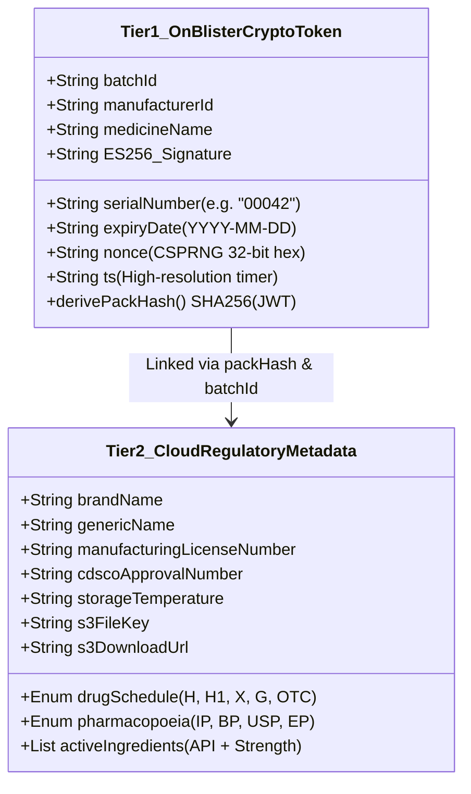
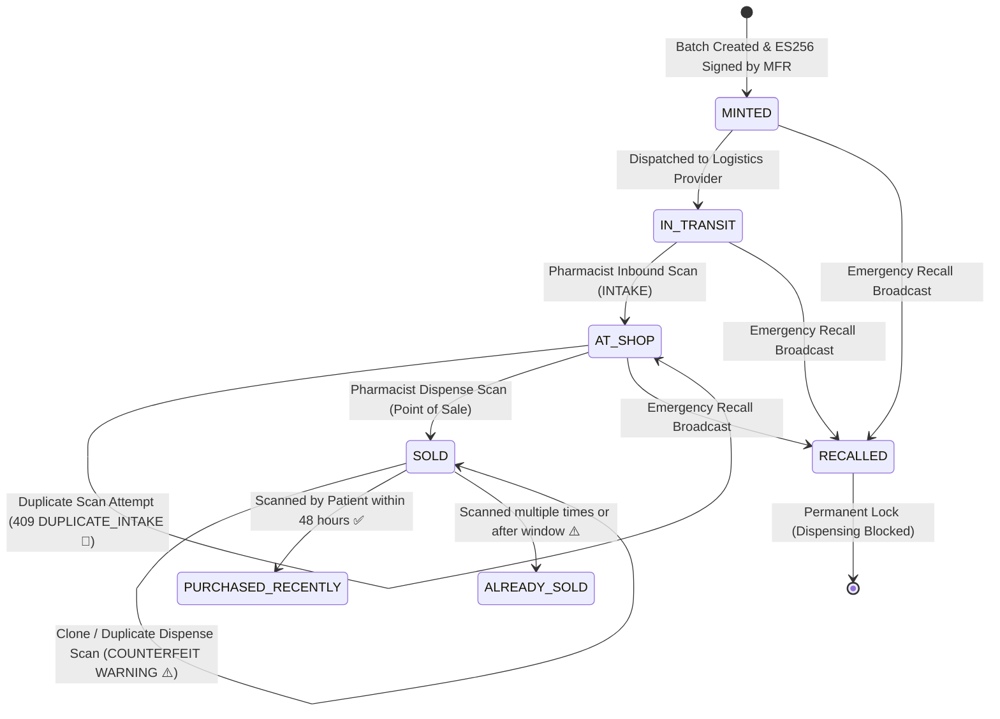
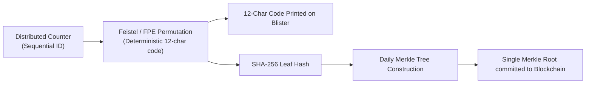

# 💊 PharmaChain: Comprehensive Project State & Pipeline Documentation
### Smart India Hackathon (SIH 2026) | National Cryptographic Drug Provenance Infrastructure
**Date:** September 2026 | **Branch:** `feature/sahil` | **System Status:** 🟢 Production Ready / End-to-End Verified

---

## 📑 Table of Contents

1. [Executive Overview & Current System State](#1-executive-overview--current-system-state)
2. [End-to-End Executed Pipelines (Detailed Flow Analysis)](#2-end-to-end-executed-pipelines-detailed-flow-analysis)
   - [2.1 Cryptographic Identity & Key Derivation Pipeline](#21-cryptographic-identity--key-derivation-pipeline)
   - [2.2 Batch Registration, Bulk Auto-Minting & S3 Pipeline](#22-batch-registration-bulk-auto-minting--s3-pipeline)
   - [2.3 Logistics & Pharmacy Inbound Intake Scan Pipeline](#23-logistics--pharmacy-inbound-intake-scan-pipeline)
   - [2.4 Point-of-Sale (POS) Dispense & Anti-Clone Defense Pipeline](#24-point-of-sale-pos-dispense--anti-clone-defense-pipeline)
   - [2.5 Citizen Verification & Authenticity Scoring Pipeline](#25-citizen-verification--authenticity-scoring-pipeline)
   - [2.6 CDSCO Emergency Recall Kill-Switch Pipeline](#26-cdsco-emergency-recall-kill-switch-pipeline)
   - [2.7 LAN Bridge & Physical Device Testing Pipeline](#27-lan-bridge--physical-device-testing-pipeline)
3. [Comprehensive Service-by-Service Architecture Breakdown](#3-comprehensive-service-by-service-architecture-breakdown)
   - [3.1 Cryptographic Core Engine (`pharma-core`)](#31-cryptographic-core-engine-pharma-core)
   - [3.2 Manufacturer Microservice (`manufacturer-service`)](#32-manufacturer-microservice-manufacturer-service)
   - [3.3 Shopkeeper & Retail Microservice (`shopkeeper-service`)](#33-shopkeeper--retail-microservice-shopkeeper-service)
   - [3.4 Consumer Public Microservice (`consumer-service`)](#34-consumer-public-microservice-consumer-service)
   - [3.5 Admin Regulatory Microservice (`admin-service`)](#35-admin-regulatory-microservice-admin-service)
   - [3.6 Spring Boot Blockchain REST Gateway (`pharma-backend`)](#36-spring-boot-blockchain-rest-gateway-pharma-backend)
   - [3.7 Hyperledger Fabric 2.5 Distributed Ledger & Smart Contract (`pharmacc`)](#37-hyperledger-fabric-25-distributed-ledger--smart-contract-pharmacc)
   - [3.8 LAN TCP Proxy Bridge (`lan-bridge.js`)](#38-lan-tcp-proxy-bridge-lan-bridgejs)
   - [3.9 Manufacturer Web Dashboard (`Manufacture-DashBoard`)](#39-manufacturer-web-dashboard-manufacture-dashboard)
   - [3.10 CDSCO Regulatory Admin Dashboard (`Admin-DashBoard`)](#310-cdsco-regulatory-admin-dashboard-admin-dashboard)
   - [3.11 Shopkeeper Web Portal (`Shopkeeper-DashBoard`)](#311-shopkeeper-web-portal-shopkeeper-dashboard)
   - [3.12 Pharmacist Mobile Application (`shopkeeper-mobile`)](#312-pharmacist-mobile-application-shopkeeper-mobile)
   - [3.13 Citizen / Consumer Mobile Application (`customer-mobile`)](#313-citizen--consumer-mobile-application-customer-mobile)
4. [Serialization & Cryptographic Standards](#4-serialization--cryptographic-standards)
5. [Supply Chain Custody State Machine & Ledger Schema](#5-supply-chain-custody-state-machine--ledger-schema)
6. [Summary of Recent Remediations & Bug Fixes](#6-summary-of-recent-remediations--bug-fixes)
7. [Future Evolution: Zero-Row Merkle Tree Scalability Architecture](#7-future-evolution-zero-row-merkle-tree-scalability-architecture)
8. [System Operations, Testing & Verification Commands](#8-system-operations-testing--verification-commands)

---

## 1. Executive Overview & Current System State

### 1.1 Project Mission
India suffers an estimated **₹40,000+ Crore annual shadow economy** in counterfeit, adulterated, and gray-market pharmaceuticals. Traditional 1D/2D barcodes suffer from the **"Dumb QR Code" flaw**: anyone can buy 1 genuine medicine blister, photocopy its barcode 10,000 times, and affix it to chalk-filled strips.

**PharmaChain** solves this through a zero-trust, mathematically unforgeable architecture combining:
1. **Asymmetric Cryptography (ECDSA NIST P-256 / ES256)**: Every medicine blister carries a cryptographically signed compact JWT with high-entropy CSPRNG nonces.
2. **Permissioned Blockchain (Hyperledger Fabric 2.5)**: Every custody handover (`MINTED` $\to$ `INTAKE` $\to$ `SOLD` $\to$ `RECALLED`) is committed to an immutable Raft consensus ledger.
3. **Double-Spend & Anti-Clone Shield**: A medicine unit can only be sold once. Subsequent scans of a cloned QR trigger instant `409 Conflict: ALREADY_SOLD (Clone Detected)` alerts.
4. **Instant Regulatory Recall**: A single transaction broadcast by CDSCO or the manufacturer immediately locks point-of-sale dispensing across all pharmacies nationwide in **< 100 milliseconds**.

### 1.2 Current Implementation State (September 2026)
- **Codebase Health**: 100% operational, fully integrated end-to-end across **5 Frontends**, **5 Backend Microservices**, and the **Hyperledger Fabric Blockchain**.
- **Active Git Branch**: `feature/sahil` (tracking `origin/feature/sahil`).
- **Recent Milestones**:
  - Auto-minting pipeline implemented: Batch registration triggers instant EC P-256 batch signing and AWS S3 CSV manifest generation.
  - Dynamic host IP resolution and `lan-bridge.js` operational: Mobile phones running Expo on Wi-Fi (`192.168.x.x`) communicate seamlessly with Kubernetes port-forwards (`3001-3005`, `4000`).
  - Strict live ES256 QR Hub: Replaced dummy placeholders with verified live tokens and copyable scan URLs.
  - Complete 100-pack lifecycle test suite passing (`scripts/test-all-100-packs-lifecycle.js`).

### 1.3 System Topology & Port Registry

```
┌──────────────────────────────────────┬──────────┬─────────────────────────────────────────────────────────────┐
│ Component Name                       │ Port     │ Technology & Role                                           │
├──────────────────────────────────────┼──────────┼─────────────────────────────────────────────────────────────┤
│ Manufacturer Web Dashboard           │ 5173     │ React 18, Vite, Redux Toolkit, TailwindCSS                  │
│ CDSCO Admin Regulatory Portal        │ 5174     │ React 18, Vite, Lucide Icons, Administrative Ops            │
│ Shopkeeper Web Portal                │ 5175     │ React 18, Vite, Pharmacy Desktop Operations                 │
│ Shopkeeper Mobile Scanner            │ 8081     │ React Native, Expo SDK 51/52, Barcode Camera                │
│ Citizen / Consumer Mobile App        │ 8082     │ React Native, Expo SDK 51/52, Public Verification Camera    │
│ manufacturer-service                 │ 3001     │ Node.js 20, Express, MongoDB Atlas, CDSCO Spec Engine       │
│ shopkeeper-service                   │ 3002     │ Node.js 20, Express, MongoDB Atlas, Inventory & POS Gate   │
│ consumer-service                     │ 3003     │ Node.js 20, Express, Public Verification & Trust Scorer     │
│ admin-service                        │ 3005     │ Node.js 20, Express, MongoDB Atlas, KYC & Recalls           │
│ pharma-core-service                  │ 4000     │ Node.js 20 WebCrypto, ES256 Vault, Merkle, JWKS, S3 Stream  │
│ Spring Boot Blockchain Gateway       │ 8080     │ Java 17, Spring Boot 3, Nimbus OAuth2, Fabric Java SDK      │
│ Hyperledger Fabric Peer 0 Org1       │ 7051     │ gRPC, mutual TLS, Endorsement & Validation                  │
│ Hyperledger Fabric Raft Orderer      │ 7050     │ Raft Consensus Engine, Block Sequencer                      │
│ Fabric CouchDB State Database        │ 5984     │ CouchDB 3.3 REST JSON Key-Value Store                       │
│ Fabric CA Org1 / CA Orderer          │ 7054/9054│ Fabric Certificate Authority, X.509 Identities              │
│ LAN Proxy Bridge Daemon              │ 3001-4000│ Node.js TCP Proxy (Binds 0.0.0.0 -> 127.0.0.1)             │
└──────────────────────────────────────┴──────────┴─────────────────────────────────────────────────────────────┘
```

---

## 2. End-to-End Executed Pipelines (Detailed Flow Analysis)

```mermaid
flowchart TD
    subgraph P1["Pipeline 1: Key Derivation & Vault Sealing"]
        A1["Cluster Master Secret"] --> A2["scrypt PBKDF & HMAC-SHA256"]
        A2 --> A3["Deterministic ECDSA P-256 Keypair"]
        A3 --> A4["AES-256-GCM Keystore Vault (:4000)"]
        A3 --> A5["RFC 7517 JWKS Endpoint (/.well-known/jwks.json)"]
    end

    subgraph P2["Pipeline 2: Manufacturing & Minting"]
        B1["Manufacturer Registers Batch (:5173)"] --> B2["manufacturer-service (:3001)"]
        B2 --> B3["pharma-core bulk mint (:4000)"]
        B3 --> B4["In-Memory ES256 Signing + CSPRNG Nonce"]
        B4 --> B5["Calculate packHash = SHA256(JWT)"]
        B4 --> B6["Stream CSV to AWS S3 & Presigned URL"]
        B4 --> B7["Submit :MINTED to Fabric via Spring Boot (:8080)"]
    end

    subgraph P3["Pipeline 3: Inbound Pharmacy Intake"]
        C1["Chemist Scans Blister (:8081)"] --> C2["LAN Bridge (:3002)"]
        C2 --> C3["shopkeeper-service (:3002)"]
        C3 --> C4["pharma-core / JWKS ECDSA Signature Audit"]
        C4 --> C5{"Duplicate Check on Fabric?"}
        C5 -- "Already Exists" --> C6["409 DUPLICATE_INTAKE Rejected 🚫"]
        C5 -- "First Intake" --> C7["Commit :INTAKE / AT_SHOP on Blockchain"]
        C7 --> C8["Upsert MongoDB Store Inventory"]
    end

    subgraph P4["Pipeline 4: POS Retail Dispense"]
        D1["Chemist Scans Pack for Sale"] --> D2["Verify Custody: currentOwner == sellerId"]
        D2 --> D3["Commit :SOLD on Blockchain"]
        D3 --> D4["Permanent Lock: Any clone scan = 409 ALREADY_SOLD ⚠️"]
        D4 --> D5["Decrement Pharmacy Stock"]
    end

    subgraph P5["Pipeline 5: Consumer Verification"]
        E1["Patient Scans QR (:8082)"] --> E2["consumer-service (:3003)"]
        E2 --> E3["Audit ES256 Math & JWKS"]
        E2 --> E4["Evaluate Blockchain Status & Recalls"]
        E4 --> E5["Compute 0-100 Trust Score & Render Leaflet"]
    end

    subgraph P6["Pipeline 6: Emergency Recall Kill-Switch"]
        F1["CDSCO Portal (:5174) Issues Form 28-A Recall"] --> F2["admin-service (:3005)"]
        F2 --> F3["POST /api/transition/recall on Fabric (:8080)"]
        F3 --> F4["Smart Contract sets <batchId>:RECALLED"]
        F4 --> F5["All subsequent scans in India trigger BATCH_RECALLED 🛑"]
    end
```



---

### 2.1 Cryptographic Identity & Key Derivation Pipeline
1. **Trigger**: When a new manufacturer registers or when `pharma-core` boots.
2. **Deterministic Derivation**:
   - Instead of storing raw unencrypted private keys, `pharma-core` derives a persistent `secp256r1` (NIST P-256) keypair using:
     $$\text{PRK} = \text{HMAC-SHA256}(\text{KEY\_ENCRYPTION\_SECRET}, \text{"pharmachain-ec-v1"})$$
     $$d = (\text{HMAC-SHA256}(\text{PRK}, \text{manufacturerId}) \pmod{N-1}) + 1$$
   - This ensures 100% key stability across container recreation or storage wipes without key leakage.
3. **Vault Sealing**:
   - The derived private key is encrypted with **AES-256-GCM** using a 32-byte key generated via `scrypt` ($\text{cost } N=16384$, salt = `manufacturerId`).
   - The encrypted blob `ivHex:authTagHex:cipherHex` is persisted in the keystore.
4. **JWKS Discovery**:
   - Public keys are exposed globally at `http://pharma-core:4000/.well-known/jwks.json`.
   - The Spring Boot gateway and domain microservices cache these keys for high-speed offline verification.

---

### 2.2 Batch Registration, Bulk Auto-Minting & S3 Pipeline
1. **Manufacturer Input**:
   - Manufacturer fills the 35+ field wizard in `Manufacture-DashBoard` (Brand name, API composition, pharmacopoeia IP/BP/USP, CDSCO license, storage temp, quantity, expiry).
2. **Auto-Mint Invocation**:
   - `manufacturer-service` receives `POST /api/manufacturer/batches` and invokes `pharma-core-service` via `mintBatchViaPharmaCore`.
3. **High-Speed In-Memory Signing**:
   - `pharma-core` decrypts the manufacturer's private key **once** (1 `scrypt` call, ~150ms).
   - Loops through $N$ packs (e.g. 100 to 100,000 units), generating unique compact ES256 JWTs with high-resolution timestamp `ts` and CSPRNG 32-bit `nonce`:
     $$\text{packHash} = \text{SHA-256}(\text{rawSignedJWT})$$
   - Performance: ~0.1ms per pack ($10,000$ packs signed in ~1.2 seconds).
4. **AWS S3 Streaming & Presigned URLs**:
   - Generates a clean CSV manifest (`serialNumber, packHash, signedToken, verifyUrl, batchId, medicineName, expiryDate`).
   - Streams CSV directly to AWS S3 bucket `pharmachain-batches`.
   - Generates a pre-signed S3 download URL valid for 24 hours.
5. **Blockchain Genesis Commitment**:
   - `pharma-core` batches `:MINTED` transitions in chunks of 250 items and submits them to `pharma-backend` (`:8080`), creating the initial immutable genesis records on Hyperledger Fabric.
6. **Frontend Result**:
   - Batch status switches directly to `● MINTED`.
   - Manufacturer can view QR codes in the **QR Hub** or download the complete CSV manifest for industrial packaging line printers.

---

### 2.3 Logistics & Pharmacy Inbound Intake Scan Pipeline
1. **Physical Scan**:
   - The chemist receives a crate of medicine blisters from the wholesale distributor.
   - Using the **Shopkeeper Mobile App** in "Inbound Stock" mode, the chemist scans the 2D DataMatrix / QR code.
2. **Network Routing via LAN Bridge**:
   - Mobile app resolves LAN IP (`http://192.168.1.9:3002/api/shopkeeper/scan/intake`).
   - The TCP proxy `lan-bridge.js` forwards the request directly to the Kubernetes pod.
3. **Cryptographic Signature Audit**:
   - `shopkeeper-service` verifies the JWT signature against `pharma-core`'s JWKS registry. If signature math is tampered, scan is rejected immediately.
4. **Double-Intake & Recall Blockchain Check**:
   - Gateway queries Hyperledger Fabric state for `packId + ":INTAKE"`.
   - If the pack was already scanned by this or another pharmacy, Fabric returns `TRANSITION_ALREADY_EXISTS`, and the service responds with `409 Conflict: DUPLICATE_INTAKE`.
   - If the parent batch has been flagged as recalled, Fabric returns `BATCH_RECALLED`.
5. **On-Chain Custody Handover**:
   - Gateway submits transaction `recordTransitionDetailed` to Fabric:
     - `packId`: `<packHash>`
     - `eventType`: `INTAKE` (or `AT_SHOP`)
     - `fromId`: `manufacturerId`
     - `toId`: `shopkeeperId`
     - Rich metadata: Chemist name, CDSCO drug license number, GPS latitude/longitude, and ISO timestamp.
6. **Inventory Synchronization**:
   - `shopkeeper-service` extracts `medicineName`, `batchId`, and `expiryDate` from the verified token and upserts the item into MongoDB `inventories` collection.
   - Mobile UI displays green verified checkmark and auto-refreshes inventory via React Navigation `useFocusEffect`.

---

### 2.4 Point-of-Sale (POS) Dispense & Anti-Clone Defense Pipeline
1. **Retail Dispense**:
   - Chemist scans the blister pack at POS checkout for a customer sale (`POST /api/shopkeeper/scan/dispense`).
2. **Custody Verification**:
   - The Java smart contract inspects `<packHash>:CURRENT`.
   - Invariant checked: Current custodian (`toId`) must equal the dispensing `sellerId`. If a chemist tries to dispense stock that was never received, transaction fails (`CUSTODY_CHAIN_VIOLATION`).
3. **Committing Terminal State `:SOLD`**:
   - Transaction committed with `eventType = "SOLD"` and `toId = "CONSUMER"`.
   - State DB updates `<packHash>:CURRENT` to `SOLD`.
4. **Anti-Clone Defense Activation**:
   - Once a pack reaches `SOLD`, the ledger locks it permanently.
   - If a counterfeiter cloned the QR 500 times:
     - The first buyer gets a genuine verification.
     - The second buyer's scan triggers **`409 Conflict: ALREADY_SOLD (Clone Detected)`** and flashes a bright red warning on mobile with $0/100$ trust score.

---

### 2.5 Citizen Verification & Authenticity Scoring Pipeline
1. **Citizen Scan**:
   - A consumer scans the medicine packaging using `customer-mobile` or any smartphone browser navigating to `https://pharmachain.gov.in/verify/{packHash}?token={signedToken}`.
2. **Zero-Auth Verification**:
   - Request hits `POST /api/consumer/verify`.
3. **Multi-Stage Verification Algorithm**:
   - **Stage 1 (Crypto Validity)**: Verifies ECDSA ES256 signature using the manufacturer's public key from JWKS. If signature fails $\to$ **0/100 Trust Score (`INVALID_SIGNATURE`)**.
   - **Stage 2 (Blockchain Recall Check)**: Checks `<batchId>:RECALLED`. If recalled $\to$ **0/100 Trust Score (`BATCH_RECALLED`)**.
   - **Stage 3 (Custody State)**:
     - If state is `AT_SHOP`: Pack is genuine, un-dispensed, and sitting in an authorized pharmacy $\to$ **98/100 Trust Score (`GENUINE_AT_SHOP`)**.
     - If state is `SOLD`: Check timestamp. If sold within 48 hours $\to$ **95/100 Trust Score (`PURCHASED_RECENTLY`)** with dispensing chemist details. If sold months ago or scanned multiple times $\to$ **0/100 Trust Score (`ALREADY_SOLD_SUSPECTED_CLONE`)**.
4. **Rich Leaflet Delivery**:
   - Response enriches the UI with drug composition, schedule (Schedule H/H1 warning), storage temperature, manufacturer license, and dispensing pharmacy GPS location.

---

### 2.6 CDSCO Emergency Recall Kill-Switch Pipeline
1. **Recall Trigger**:
   - CDSCO Regulator or Manufacturer detects contamination and submits `POST /api/transition/recall` with reason (e.g. "Impurity detected above permissible limit - Form 28-A").
2. **Fabric Atomic Commitment**:
   - Smart contract executes `recallBatch`:
     - Sets `<batchId>:RECALLED = { reason, actorId, recallDate, recallTime }`.
     - Emits chaincode event `BatchRecalled`.
3. **Global POS Lock**:
   - Within **< 100 milliseconds**, any subsequent scan on any unit of this batch across all 5 frontends and 5 services returns `BATCH_RECALLED`.
   - Chemists are physically prevented from dispensing the medicine at checkout.

---

### 2.7 LAN Bridge & Physical Device Testing Pipeline
1. **The Mobile Wi-Fi Dilemma**:
   - Kubernetes/Minikube port-forward binds strictly to loopback `127.0.0.1`.
   - Physical smartphones connected to local Wi-Fi (`192.168.1.9`) cannot reach `127.0.0.1`, resulting in `Network Error`.
2. **The TCP Proxy Solution**:
   - `scripts/lan-bridge.js` runs a multi-port Node.js TCP proxy binding to `0.0.0.0`.
   - Any packet received from the phone on `192.168.1.9:3002` is transparently piped over raw TCP to `127.0.0.1:3002`.
   - Mobile apps dynamically detect host IP via `Constants.expoConfig?.hostUri` or `window.location.hostname`.

---

## 3. Comprehensive Service-by-Service Architecture Breakdown

### 3.1 Cryptographic Core Engine (`pharma-core`)
- **Port**: `4000`
- **Framework**: Node.js 20, Express, WebCrypto, native `crypto`, `jsonwebtoken`, `@aws-sdk/client-s3`.
- **Primary Role**: The central cryptographic vault and signing authority for the entire ecosystem.
- **Key Modules & Files**:
  - `src/services/crypto.service.js`:
    - `deriveDeterministicKeyPair()`: Deterministically generates NIST P-256 EC keys using `HMAC-SHA256` from master secret.
    - `generateManufacturerKey()`: Encrypts private keys using `scrypt` + `AES-256-GCM` and persists to `keystore.json`.
    - `signPackJwt()` / `mintPacksBatch()`: Bulk signs up to 100k JWTs in memory in a single scrypt pass.
    - `verifyPackJwt()`: Multi-tier verification against local keystore, deterministic derivations, or manufacturer-service fallbacks.
    - `signCoreJwt()`: Generates RS256 RSA-4096 machine-to-machine JWTs for Spring Boot OAuth2 resource server authentication.
    - `buildJwks()`: Compiles RFC 7517 JSON Web Key Set exposing all active and historical ES256 and RS256 public keys.
  - `src/services/s3.service.js`: Uploads CSV manifests to AWS S3 and generates pre-signed download URLs.
  - `src/routes/jwks.routes.js`: Serves `GET /.well-known/jwks.json`.
  - `src/routes/batch.routes.js`: Exposes `POST /core/batch/mint`, `GET /core/batch/preview`, `GET /core/batch/csv`.

---

### 3.2 Manufacturer Microservice (`manufacturer-service`)
- **Port**: `3001`
- **Framework**: Node.js 20, Express, Mongoose (MongoDB Atlas), Axios.
- **Primary Role**: Manages pharmaceutical batch master records, statutory CDSCO drug formulation profiles, and S3 manifest exports.
- **Database Models**:
  - `Batch`: Stores 35+ statutory CDSCO parameters:
    - Identifiers: `systemBatchId`, `manufacturerBatchNumber`, `medicineName`, `genericName`, `brandName`.
    - Regulatory: `drugSchedule` (`H`, `H1`, `X`, `G`, `OTC`), `pharmacopoeia` (`IP`, `BP`, `USP`, `EP`), `cdscoApprovalNumber`, `manufacturingLicenseNumber`.
    - Physical: `packDimensions`, `packagingType`, `activeIngredients` (API list with strength), `storageTemperature`, `humidityControl`.
    - Mint State: `mintStatus` (`PENDING`, `MINTING`, `MINTED`, `RECALLED`), `totalQuantity`, `packsMinted`, `s3FileKey`, `s3DownloadUrl`.
  - `Manufacturer`: Company registration, KYC status (`PENDING`, `VERIFIED`, `REJECTED`), corporate address, certified public key list.
  - `Pack`: Lightweight metadata index mapping `packHash` to parent `systemBatchId`.
- **Key Capabilities**:
  - Auto-minting integration: Directly schedules EC signing in `pharma-core` during `createBatchController`.
  - Direct CSV stream: `exportBatchCsvController` streams large CSV files directly to web clients.
  - Public Key Gateway: Exposes `GET /api/manufacturer/public/key/:id` so other services can resolve public keys.

---

### 3.3 Shopkeeper & Retail Microservice (`shopkeeper-service`)
- **Port**: `3002`
- **Framework**: Node.js 20, Express, Mongoose (MongoDB Atlas).
- **Primary Role**: Retail pharmacy inventory management, wholesale inbound intake verification, and POS consumer dispense gateway.
- **Database Models**:
  - `Inventory`: Tracks pharmacy stock by `packHash`, `medicineName`, `batchId`, `expiryDate`, `mrp`, `intakeTimestamp`, and status (`IN_STOCK`, `SOLD`, `QUARANTINED`).
  - `Shopkeeper`: Pharmacy store profile, owner identity, State Pharmacy Council drug license (`licenseNumber`), GSTIN, GPS coordinates, KYC approval status.
  - `Transaction`: Audit log of all retail dispensing events with buyer contact and price.
  - `Incident`: Suspicious scan and counterfeit report logger (records duplicate scan attempts).
- **Key Capabilities**:
  - `intakeScanController`: Verifies signed blister token, verifies non-duplicate status with Fabric, triggers `INTAKE` on blockchain, and upserts local stock.
  - `dispenseScanController`: Verifies ownership, checks recall status, commits `SOLD` to Fabric, and decrements stock.
  - Live Dashboard Stats: Computes `currentStock`, `isLowStock`, `isExpiringSoon` (< 90 days), and daily dispensing volume.

---

### 3.4 Consumer Public Microservice (`consumer-service`)
- **Port**: `3003`
- **Framework**: Node.js 20, Express, Axios.
- **Primary Role**: High-speed, public-facing, zero-authentication medicine authenticity verification engine.
- **Key Capabilities**:
  - `POST /api/consumer/verify`:
    - Decodes incoming QR token.
    - Audits ES256 ECDSA digital signature against `pharma-core` JWKS.
    - Calls `pharma-backend` (`:8080`) to query live blockchain custody state and recall status.
    - Fetches Tier-2 regulatory specs from `manufacturer-service`.
    - Returns calculated Authenticity Trust Score (0 to 100), verification badge, drug schedule leaflet, and pharmacy dispensary details.
  - `POST /api/consumer/report`: Allows citizens to report counterfeit or tampered medicines with geolocation and photo evidence.

---

### 3.5 Admin Regulatory Microservice (`admin-service`)
- **Port**: `3005`
- **Framework**: Node.js 20, Express, Mongoose (MongoDB Atlas).
- **Primary Role**: Central regulatory portal for the Central Drugs Standard Control Organisation (CDSCO) and state drug controllers.
- **Key Capabilities**:
  - KYC Verification: Review and approve/reject pharmaceutical manufacturers and retail pharmacy drug licenses (`POST /api/admin/manufacturer/kyc/approve`).
  - Nationwide Surveillance: Real-time map and audit feed of all minting, intake, and sales events across India.
  - Emergency Recall Broadcast: Submits statutory Form 28-A batch recalls directly to Hyperledger Fabric (`POST /api/admin/recall`).
  - System Health & Audit Metrics: High-level analytics on active manufacturers, verified packs, recalled units, and reported counterfeit incidents.

---

### 3.6 Spring Boot Blockchain REST Gateway (`pharma-backend`)
- **Port**: `8080`
- **Framework**: Java 17, Spring Boot 3.2, Nimbus JOSE JWT, Hyperledger Fabric Gateway SDK for Java.
- **Primary Role**: Secure enterprise bridge connecting HTTP/JSON microservices to the gRPC/mutual TLS Hyperledger Fabric network.
- **Key Modules & Controllers**:
  - `SecurityConfig.java`: Configured as an OAuth2 Resource Server. Validates inbound bearer tokens against `PHARMA_CORE_JWKS_URL` (`http://host.docker.internal:4000/.well-known/jwks.json`).
  - `TransitionController.java`:
    - `POST /api/transition`: Records a single custody transition on Fabric (`recordTransitionBatch`).
    - `POST /api/transition/batch`: Submits bulk transitions (up to 250 items/call) to optimize block packaging.
    - `POST /api/transition/recall`: Invokes `recallBatch` on the smart contract.
    - `GET /api/transition/status`: Evaluates current pack state with recall priority.
    - `GET /api/transition/pack/{hash}/current`: Reads current owner and status from CouchDB.
    - `GET /api/transition/pack/{hash}/history`: Returns immutable audit trail of every block transition for a pack.
  - `FabricConfig.java`: Establishes managed gRPC connection to `peer0.pharmachain.net:7051` using Org1MSP X.509 cryptographic credentials.

---

### 3.7 Hyperledger Fabric 2.5 Distributed Ledger & Smart Contract (`pharmacc`)
- **Network**: Channel `mychannel`, Single-Org (`Org1MSP`), Raft Consensus Orderer.
- **State Database**: CouchDB (`couchdb0:5984`).
- **Chaincode Language**: Java 17 (`PharmaContract.java` compiled into `pharmacc.jar`).
- **State Machine Invariants**:
  1. **Genesis Rule**: Every pack must start with `MINTED` (or `MFG`). Direct jumps to `INTAKE` or `SOLD` are rejected.
  2. **Anti-Double-Spend**: If a pack is already in state `SOLD`, any subsequent transition attempt throws `ALREADY_SOLD`.
  3. **Custody Continuity**: When recording a sale, `fromId` must match the current owner recorded in `toId` of the preceding `AT_SHOP` event.
  4. **Batch Recall Cascade**: If `<batchId>:RECALLED` exists in world state, any transaction or status query on packs linked to that batch returns `BATCH_RECALLED`.

---

### 3.8 LAN TCP Proxy Bridge (`lan-bridge.js`)
- **Port**: Listens on `0.0.0.0` for ports `3001, 3002, 3003, 3005, 4000`.
- **Framework**: Node.js native `net` module (zero external dependencies).
- **Primary Role**: Resolves local development network isolation. Maps incoming Wi-Fi connections from physical phones (`192.168.x.x`) to Kubernetes port-forwards bound to loopback `127.0.0.1`.

---

### 3.9 Manufacturer Web Dashboard (`Manufacture-DashBoard`)
- **Port**: `5173`
- **Framework**: React 18, Vite, Redux Toolkit, TailwindCSS.
- **Key Modules**:
  - **Batch Creation Wizard**: Multi-step modal capturing formulation details, CDSCO schedule, storage conditions, and pack quantities.
  - **Live Cryptographic QR Hub**: Displays real-time generated 2D DataMatrix/QR codes. Features status indicators (`● Live Authenticated QR` vs `○ Mint Required`) and 1-click token/scan URL copy buttons.
  - **S3 Manifest Downloader**: Directly downloads complete CSV manifests with pre-signed S3 links.
  - **Recall Center**: Allows manufacturers to issue voluntary product recalls with reason documentation.

---

### 3.10 CDSCO Regulatory Admin Dashboard (`Admin-DashBoard`)
- **Port**: `5174`
- **Framework**: React 18, Vite, Lucide Icons.
- **Key Modules**:
  - **KYC Verification Desk**: Tabular review of pharmaceutical plant licenses and retail chemist permits.
  - **Nationwide Surveillance Grid**: Real-time map and statistical widgets showing track-and-trace velocity.
  - **Statutory Recall Command**: Issues national recall directives across India.

---

### 3.11 Shopkeeper Web Portal (`Shopkeeper-DashBoard`)
- **Port**: `5175`
- **Framework**: React 18, Vite.
- **Key Modules**:
  - Real-time inventory grid with search and category filtering.
  - Low-stock and near-expiry warning widgets.
  - Point-of-Sale transaction history and sales analytics.

---

### 3.12 Pharmacist Mobile Application (`shopkeeper-mobile`)
- **Port**: `8081` (Expo Go)
- **Framework**: React Native, Expo SDK 51/52, Camera Barcode Scanner, Zustand.
- **Key Features**:
  - **Dynamic Host Resolution**: Automatically parses Wi-Fi IP (`192.168.x.x:3002`) to bypass localhost connection bugs.
  - **Inbound Stock Mode**: Rapid camera scanning of medicine blisters upon delivery from distributors. Real-time duplicate detection.
  - **Retail Dispense Mode**: Point-of-sale scanner marking medicines as sold to patients.
  - **Auto-Refreshing Inventory**: Implements React Navigation `useFocusEffect` to instantly refresh stock upon exiting the camera.

---

### 3.13 Citizen / Consumer Mobile Application (`customer-mobile`)
- **Port**: `8082` (Expo Go)
- **Framework**: React Native, Expo SDK 51/52.
- **Key Features**:
  - **Instant 1-Tap QR Scanner**: Scans blisters and contacts `consumer-service` (`:3003`).
  - **Visual Trust Score Meter**: Gauge from 0 to 100 displaying authenticity status.
  - **Interactive Drug Leaflet**: CDSCO Schedule warnings, composition, dosage, storage guidelines, and manufacturing details.
  - **Whistleblower Report Flow**: Form to report fake medicines with GPS location and packaging photos.

---

## 4. Serialization & Cryptographic Standards

PharmaChain adopts a **Two-Tier Serialization Architecture** to balance packaging space constraints with regulatory richness:



### 4.1 Cryptographic Formulas
1. **Digital Signature Standard (ES256)**:
   $$\text{Signature} = \text{ECDSA}_{\text{PrivKey}_{\text{MFR}}}(\text{SHA-256}(\text{Header} \parallel \text{Payload}))$$
   - Algorithm: `ES256` (ECDSA using secp256r1 curve with SHA-256).
   - Key Protection: Encrypted at rest via **AES-256-GCM** with master vault keys derived using memory-hard `scrypt` ($\text{cost } N=16384$).
2. **Primary Key Derivation (`packHash`)**:
   $$\text{packHash} = \text{SHA-256}(\text{rawSignedJWT})$$
   - Uniquely identifies the physical blister across all databases and blockchain world-state without storing cleartext tokens.

---

## 5. Supply Chain Custody State Machine & Ledger Schema

### 5.1 The 6-State Custody Lifecycle



### 5.2 CouchDB Ledger Key Schema

```
┌──────────────────────────────────────┬────────────────────────────────────────────────────────┐
│ State Key Format                     │ Purpose & Stored Content                               │
├──────────────────────────────────────┼────────────────────────────────────────────────────────┤
│ <packHash>:MINTED                    │ Genesis mint record (mfrId, sellingDate, timestamp)    │
│ <packHash>:INTAKE                    │ Inbound pharmacy receipt record (shopId, GPS, license) │
│ <packHash>:AT_SHOP                   │ Shelf placement confirmation                           │
│ <packHash>:SOLD                      │ Terminal consumer sale record (sellerId, buyerId)      │
│ <packHash>:CURRENT                   │ Fast-lookup pointer to the latest transition state     │
│ <packHash>:BATCH                     │ Reference pointer linking packHash to parent batchId   │
│ <batchId>:RECALLED                   │ Emergency recall directive with Form 28-A ground       │
└──────────────────────────────────────┴────────────────────────────────────────────────────────┘
```

---

## 6. Summary of Recent Remediations & Bug Fixes

As documented in `CHANGELOG_AND_ERROR_LOG.md`, six critical system-wide integration issues were diagnosed and permanently remediated:

1. **Mobile "Network Error" on Physical Testing Phones**:
   - *Cause*: Kubernetes port-forward binds strictly to `127.0.0.1`.
   - *Fix*: Created `scripts/lan-bridge.js` proxying `0.0.0.0` (all interfaces) to K8s loopback ports. Added dynamic host resolution in Expo apps.
2. **"Counterfeit Warning / INVALID-SIGNATURE" on Mobile Scanners**:
   - *Cause*: Unminted batches fell back to a dummy placeholder signature string.
   - *Fix*: Enforced strict live ES256 QR rendering, added auto-key derivation, and blocked placeholder strings.
3. **Batches Stuck in "PENDING" State**:
   - *Cause*: `MINT_STATUS` in `batch.controller.js` was an Array, causing `batch.mintStatus = MINT_STATUS.MINTED` to evaluate to `undefined`.
   - *Fix*: Corrected to `batch.mintStatus = 'MINTED'` and embedded `mintBatchViaPharmaCore` into batch creation.
4. **CSV Manifest Truncated at 100 Rows**:
   - *Cause*: Hardcoded `Math.min(..., 100)` cap and 302 redirect behavior in export controller.
   - *Fix*: Replaced redirect with direct CSV stream and raised preview limits to 1,000 in routes.
5. **Shopkeeper Mobile Populated with Mock Constants**:
   - *Cause*: UI was reading static mock arrays rather than calling backend APIs.
   - *Fix*: Replaced with live REST queries and added `useFocusEffect` auto-refresh on camera scan.
6. **Spring Boot Gateway JWKS Connection Error in Docker**:
   - *Cause*: Container attempted connecting to `pharma-core:4000` which was running on the host machine.
   - *Fix*: Configured `PHARMA_CORE_JWKS_URL=http://host.docker.internal:4000/.well-known/jwks.json` and added `extra_hosts` in `docker-compose.yml`.

---

## 7. Future Evolution: Zero-Row Merkle Tree Scalability Architecture

To support scaling to **20–30 million medicine packages per day** (~10 billion packages/year) without overwhelming database row storage and B-tree indexes, the project includes an architectural blueprint (`medicine_verification_zero_row_merkle_architecture.md`):



### Core Innovations:
- **Zero-Row Code Generation**: No database rows are inserted merely to record code existence. Sequential IDs are transformed deterministically into printable 12-character alphanumeric codes via Feistel cipher.
- **Daily Merkle Tree Compression**: 30 million leaf hashes are compressed into a single 32-byte Merkle Root committed to Hyperledger Fabric.
- **Logarithmic Proofs**: Verification requires only a 25-hash Merkle proof path ($\log_2(30,000,000) \approx 25$), enabling sub-millisecond SMS and web verification with near-zero database storage.

---

## 8. System Operations, Testing & Verification Commands

### 8.1 Starting the System

#### Step 1: Start Hyperledger Fabric Blockchain & Gateway
```bash
cd blockchain-server
docker compose up --build -d
```
*Health Check*: `curl http://localhost:8080/actuator/health` $\to$ `{"status":"UP"}`.

#### Step 2: Start Kubernetes Microservices Cluster
```bash
cd server
skaffold run
```

#### Step 3: Start LAN TCP Proxy Bridge (for Mobile Devices)
```bash
cd server
node scripts/lan-bridge.js
```

#### Step 4: Launch Web Dashboards
```bash
# Manufacturer Dashboard (:5173)
cd frontend/Manufacture-DashBoard && npm run dev

# CDSCO Admin Dashboard (:5174)
cd frontend/Admin-DashBoard && npm run dev

# Shopkeeper Web Portal (:5175)
cd frontend/Shopkeeper-DashBoard && npm run dev
```

#### Step 5: Launch Mobile Applications
```bash
# Pharmacist Mobile Scanner (:8081)
cd frontend/shopkeeper-mobile && npx expo start -c

# Citizen Verification App (:8082)
cd frontend/customer-mobile && npx expo start -c
```

---

### 8.2 Automated Test Suites

#### 1. End-to-End Cryptographic & Verification Lifecycle Test
```bash
cd scripts
node test-e2e-crypto-lifecycle.js
```
*Validates*: Deterministic key derivation, live ES256 signing, JWKS discovery, S3 CSV upload, and signature verification.

#### 2. Complete 100-Pack Custody Lifecycle Test
```bash
cd scripts
node test-all-100-packs-lifecycle.js
```
*Validates*: Minting 100 packs $\to$ wholesale intake $\to$ duplicate intake rejection $\to$ retail sale $\to$ clone detection $\to$ recall priority lock.

---
*Documentation compiled automatically for PharmaChain (SIH 2026).*
