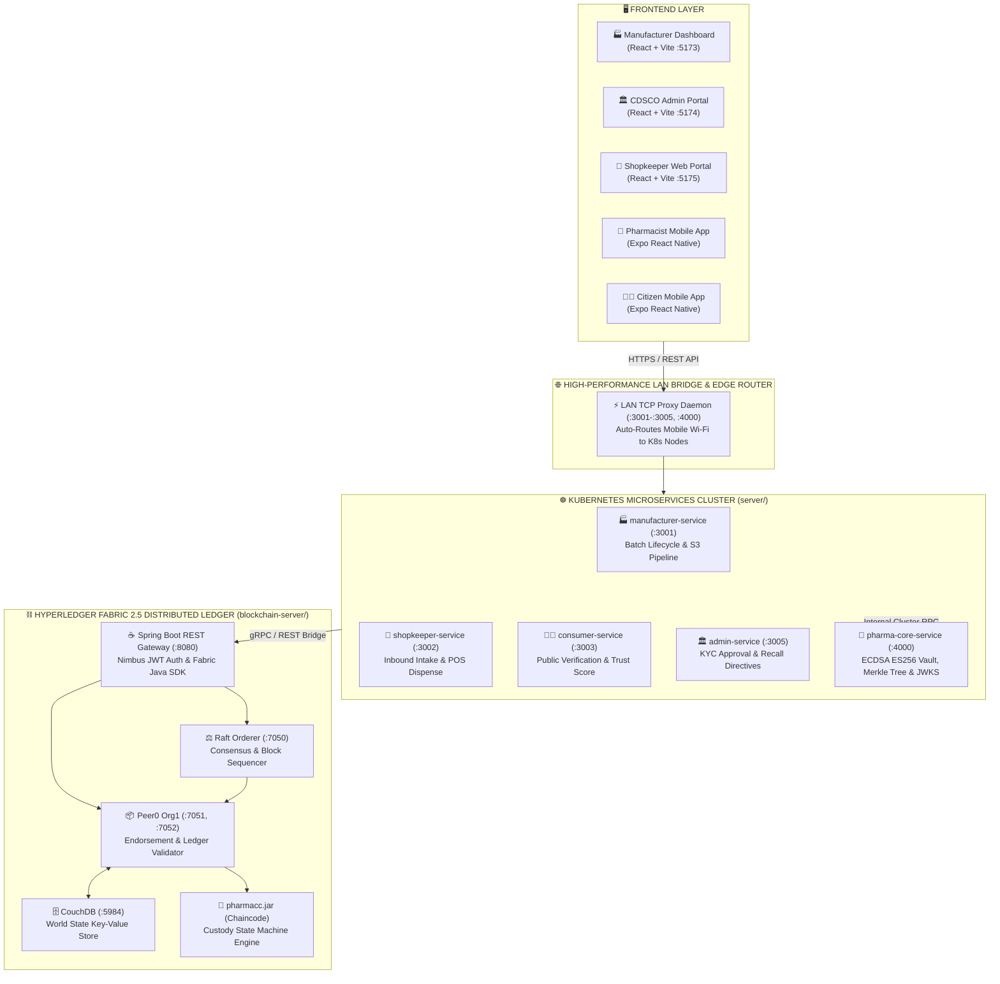
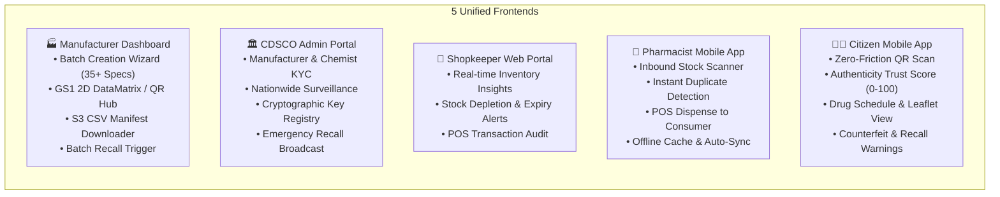
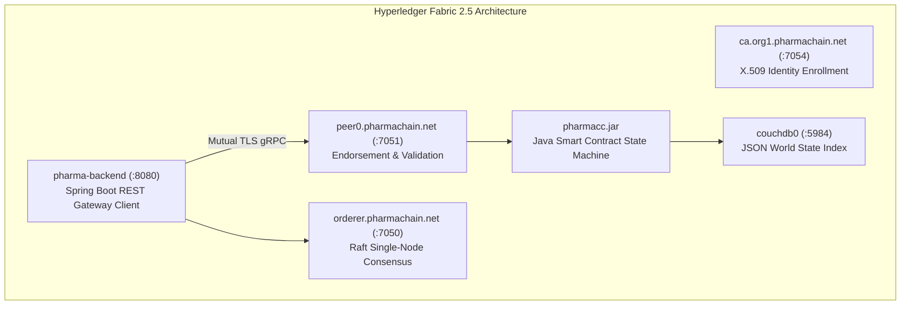
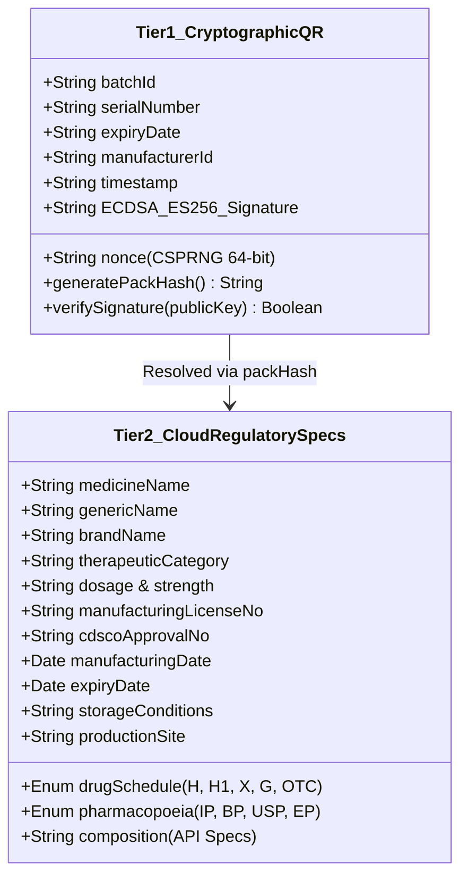
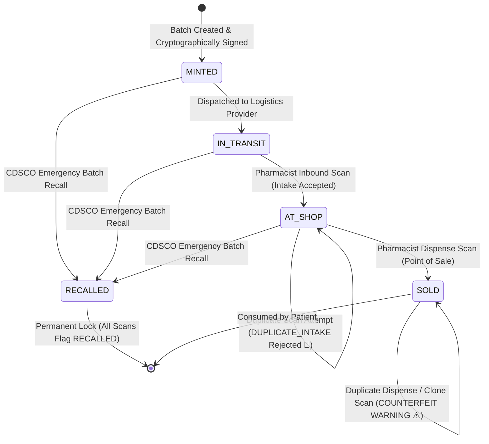
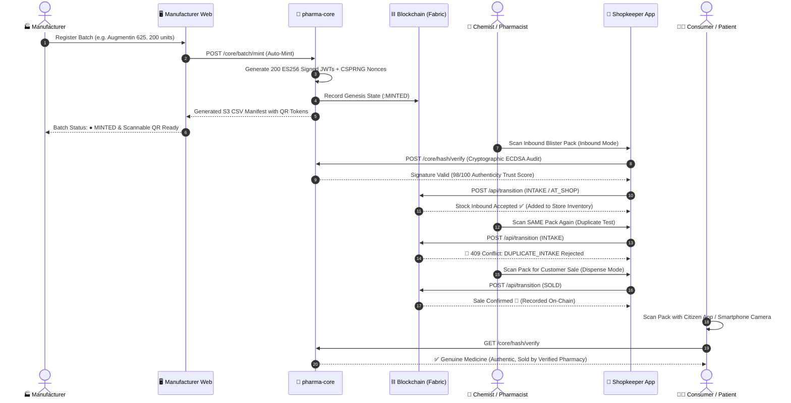

# 💊 PharmaChain: National Cryptographic Drug Provenance & Track-and-Trace Infrastructure
### Smart India Hackathon (SIH 2026) | Decentralized Anti-Counterfeit Medicine Network

[](https://nodejs.org/)
[](https://spring.io/projects/spring-boot)
[](https://reactjs.org/)
[](https://expo.dev/)
[](https://www.hyperledger.org/projects/fabric)
[](https://kubernetes.io/)
[](https://en.wikipedia.org/wiki/Elliptic_Curve_Digital_Signature_Algorithm)
[](LICENSE)

---

## 📌 Table of Contents

1. [Executive Summary & Problem Statement](#1-executive-summary--problem-statement)
2. [End-to-End System Architecture](#2-end-to-end-system-architecture)
3. [The Three-Tier Ecosystem Breakdown](#3-the-three-tier-ecosystem-breakdown)
   - [Tier 1: Frontend Applications (3 Dashboards + 2 Mobile Apps)](#tier-1-frontend-applications)
   - [Tier 2: Cloud-Native Microservices Cluster (`server/`)](#tier-2-cloud-native-microservices-cluster)
   - [Tier 3: Distributed Ledger & Smart Contracts (`blockchain-server/`)](#tier-3-distributed-ledger--smart-contracts)
4. [Cryptographic Vault & Two-Tier Serialization](#4-cryptographic-vault--two-tier-serialization)
5. [Supply Chain State Machine & Custody Lifecycle](#5-supply-chain-state-machine--custody-lifecycle)
6. [Complete End-to-End Sequence Flow](#6-complete-end-to-end-sequence-flow)
7. [Threat Model & Security Defense Matrix](#7-threat-model--security-defense-matrix)
8. [Network Topology & Port Registry](#8-network-topology--port-registry)
9. [Repository Blueprint & File Structure](#9-repository-blueprint--file-structure)
10. [Step-by-Step Installation & Running Guide](#10-step-by-step-installation--running-guide)

---

## 1. Executive Summary & Problem Statement

Counterfeit, substandard, and diverted pharmaceuticals represent a **₹40,000+ Crore annual shadow economy in India**, posing severe public health risks.

```
┌─────────────────────────────────────────────────────────────────────────────────────────────────────────┐
│                                   THE "DUMB QR CODE" VULNERABILITY                                      │
├───────────────────────────────┬─────────────────────────────────────────────────────────────────────────┤
│ ❌ The Photocopy / Clone Flaw │ Anyone with a scanner can buy 1 genuine medicine blister, photocopy its │
│                               │ QR code 10,000 times, and paste it on 10,000 chalk-filled fake strips.   │
├───────────────────────────────┼─────────────────────────────────────────────────────────────────────────┤
│ ❌ No Cryptographic Proof     │ Traditional 1D/2D barcodes contain plain text (URL/ID). They have no    │
│                               │ digital signature proving if Cipla, Sun Pharma, or a counterfeiter made │
│                               │ the label.                                                              │
├───────────────────────────────┼─────────────────────────────────────────────────────────────────────────┤
│ ❌ Zero Recall Speed          │ When contamination occurs, manual phone/email recalls take weeks,       │
│                               │ leaving toxic batches in pharmacy shelves and consumer hands.           │
└───────────────────────────────┴─────────────────────────────────────────────────────────────────────────┘
```

### The PharmaChain Solution
PharmaChain establishes an **unforgeable mathematical and blockchain-backed provenance infrastructure**:
* **Military-Grade Asymmetric Signatures (ECDSA NIST P-256 / ES256)**: Every medicine pack is minted with a unique cryptographically signed JSON Web Token (JWT) containing a high-entropy CSPRNG nonce.
* **Immutable Hyperledger Fabric Ledger**: Custody events (`MINTED` $\to$ `INTAKE` $\to$ `SOLD` $\to$ `RECALLED`) are committed on-chain. If a cloned barcode is scanned twice, the system instantly triggers a **`DUPLICATE_INTAKE`** or **`ALREADY_SOLD (Clone Detected)`** warning.
* **Instant Regulatory Recall Kill-Switch**: A single recall transaction broadcast by CDSCO or the manufacturer instantly locks POS dispensing across all pharmacies nationwide in **< 100 milliseconds**.

---

## 2. End-to-End System Architecture



---

## 3. The Three-Tier Ecosystem Breakdown

### Tier 1: Frontend Applications



---

### Tier 2: Cloud-Native Microservices Cluster

| Service Name | Port | Primary Responsibilities | Storage / Tech |
| :--- | :---: | :--- | :--- |
| **`manufacturer-service`** | `3001` | Batch generation, CDSCO Tier-2 formulations, automatic ES256 mint scheduling, S3 streaming. | MongoDB, Express.js, Axios |
| **`shopkeeper-service`** | `3002` | Retail intake verification, duplicate pack blocking, POS dispensing, inventory tracking. | MongoDB, Express.js |
| **`consumer-service`** | `3003` | Public scan lookup, cryptographic signature audit, patient safety leaflet display. | Express.js, Node.js |
| **`admin-service`** | `3005` | Regulatory KYC approval, cryptographic public key auditing, nationwide recall coordination. | MongoDB, Express.js |
| **`pharma-core-service`** | `4000` | Asymmetric ECDSA signing engine, AES-256-GCM keystore vault, Merkle tree genesis, JWKS server. | Node.js Crypto, Scrypt, S3 |

---

### Tier 3: Distributed Ledger & Smart Contracts



---

## 4. Cryptographic Vault & Two-Tier Serialization

PharmaChain divides serialization data into **Tier 1 (On-Blister Cryptography)** and **Tier 2 (Rich Regulatory Cloud Metadata)**:



### Digital Signature Standard:
$$\text{Signature} = \text{ECDSA}_{\text{PrivKey}_{\text{MFR}}}(\text{SHA-256}(\text{Header} \parallel \text{Payload}))$$
* **Algorithm**: `ES256` (ECDSA on NIST P-256 curve with SHA-256 hash).
* **Key Protection**: Encrypted at rest using **AES-256-GCM** with master vault keys derived via `scrypt`.
* **Discovery**: Public keys published globally via RFC 7517 compliant JWKS at `http://pharma-core:4000/.well-known/jwks.json`.

---

## 5. Supply Chain State Machine & Custody Lifecycle



---

## 6. Complete End-to-End Sequence Flow



---

## 7. Threat Model & Security Defense Matrix

| Threat Vector | Attack Mechanism | PharmaChain Defense Mechanism |
| :--- | :--- | :--- |
| **Photocopy / QR Cloning** | Counterfeiter copies a valid QR and prints 10,000 labels. | **Blockchain Custody Check**: Once pack is marked `SOLD`, subsequent scans trigger `ALREADY_SOLD / DUPLICATE CLONE`. |
| **Signature Forgery** | Attacker crafts a fake QR with modified expiry date. | **ECDSA NIST P-256 Curve Math**: Signature verification fails immediately ($0/100$ Trust Score). |
| **Front-Running / Diversion** | Retailer sells stolen medicine without receiving it. | **State Machine Enforce**: Cannot execute `SOLD` unless previous state is `AT_SHOP`. |
| **Serial Guessing** | Pre-printing sequential numbers (`001`, `002`). | **CSPRNG 64-bit Nonce**: Every pack has cryptographically unpredictable entropy. |
| **Private Key Theft** | Hacker tries extracting manufacturer signing keys. | **AES-256-GCM Sealed Keystore**: Master vault keys derived with `scrypt` memory-hard hashing. |
| **Network Interception** | Man-in-the-Middle on mobile Wi-Fi scan requests. | **Mutual TLS & LAN Bridge TCP Tunneling**: Encrypted point-to-point payloads. |

---

## 8. Network Topology & Port Registry

```
┌──────────────────────────────┬──────────┬─────────────────────────────────────────────────────────────────┐
│ Service Component            │ Port     │ Technology & Protocol                                           │
├──────────────────────────────┼──────────┼─────────────────────────────────────────────────────────────────┤
│ Manufacturer Dashboard       │ 5173     │ React 18, Vite, Redux Toolkit, TailwindCSS                      │
│ CDSCO Admin Dashboard        │ 5174     │ React 18, Vite, Lucide Icons                                    │
│ Shopkeeper Dashboard         │ 5175     │ React 18, Vite                                                  │
│ Shopkeeper Mobile Scanner    │ 8081     │ React Native, Expo SDK 51, Camera Barcode Scanner               │
│ Consumer Citizen App         │ 8082     │ React Native, Expo SDK 51                                       │
│ manufacturer-service         │ 3001     │ Node.js 20, Express, MongoDB Atlas, REST                        │
│ shopkeeper-service           │ 3002     │ Node.js 20, Express, MongoDB Atlas, REST                        │
│ consumer-service             │ 3003     │ Node.js 20, Express, REST                                       │
│ admin-service                │ 3005     │ Node.js 20, Express, MongoDB Atlas, REST                        │
│ pharma-core-service          │ 4000     │ Node.js 20, WebCrypto, ES256, Merkle Engine, JWKS Server        │
│ Spring Boot Fabric Gateway   │ 8080     │ Java 17, Spring Boot 3, Nimbus OAuth2, Fabric Java SDK          │
│ Hyperledger Fabric Peer      │ 7051     │ gRPC, mutual TLS, Hyperledger Fabric 2.5                        │
│ Hyperledger Fabric Orderer   │ 7050     │ Raft Consensus Engine, gRPC                                     │
│ Fabric CouchDB State DB      │ 5984     │ CouchDB 3.3 REST JSON Store                                     │
│ LAN Proxy Bridge Daemon      │ 3001-4000│ Node.js net TCP Bridge (Proxies Wi-Fi 192.168.x.x to K8s)       │
└──────────────────────────────┴──────────┴─────────────────────────────────────────────────────────────────┘
```

---

## 9. Repository Blueprint & File Structure

```
SIH-Pharma/
├── blockchain-server/                  # ⛓️ Hyperledger Fabric 2.5 Network & Gateway
│   ├── backend/                        # Spring Boot REST Gateway (:8080)
│   ├── chaincode/                      # Java Smart Contracts (pharmacc.jar)
│   ├── organizations/                  # Fabric CA, MSP Credentials, TLS Certs
│   ├── scripts/                        # Channel creation & chaincode deployment scripts
│   └── docker-compose.yml              # Complete Fabric container stack
│
├── server/                             # ☸️ Kubernetes Microservices Cluster
│   ├── k8s/                            # Unified Kubernetes deployment manifests & secrets
│   ├── scripts/
│   │   └── lan-bridge.js               # ⚡ High-performance TCP proxy for mobile Wi-Fi testing
│   ├── services/
│   │   ├── admin/                      # Central CDSCO regulatory microservice (:3005)
│   │   ├── consumer/                   # Public consumer scan & verification service (:3003)
│   │   ├── manufacturer/               # Batch creation, S3 CSV pipeline, KYC (:3001)
│   │   ├── pharma-core/                # ECDSA ES256 crypto engine & JWKS server (:4000)
│   │   └── shopkeeper/                 # Pharmacy inventory & POS dispense service (:3002)
│   ├── skaffold.yml                    # Skaffold live sync & container build config
│   └── package.json
│
└── frontend/                           # 🖥️ Web Dashboards & Mobile Applications
    ├── Admin-DashBoard/                # CDSCO Administrator web portal (:5174)
    ├── Manufacture-DashBoard/          # Pharmaceutical Manufacturer portal (:5173)
    ├── Shopkeeper-DashBoard/           # Pharmacy web operations portal (:5175)
    ├── shopkeeper-mobile/              # React Native / Expo app for Chemists
    └── customer-mobile/                # React Native / Expo app for Consumers
```

---

## 10. Step-by-Step Installation & Running Guide

### Prerequisites
* **Node.js**: v20.x or higher
* **Docker Desktop**: Enabled with Kubernetes
* **Skaffold & kubectl**: Installed and in system PATH
* **Expo Go**: Installed on physical Android / iOS testing device

---

### Step 1: Start Hyperledger Fabric Blockchain Stack
```bash
cd blockchain-server
docker compose up --build -d
```
*Verify gateway health*: Open `http://localhost:8080/actuator/health` $\to$ returns `{"status":"UP"}`.

---

### Step 2: Start Kubernetes Microservices Cluster
```bash
cd server
skaffold dev
```
*All 5 services (`manufacturer`, `shopkeeper`, `consumer`, `admin`, `pharma-core`) will deploy into your local cluster with live port-forwarding.*

---

### Step 3: Launch LAN Bridge Proxy (For Mobile Device Wi-Fi Connectivity)
```bash
cd server
npm run lan-bridge
```
*This binds your computer's Wi-Fi IP (`192.168.x.x`) to the internal Kubernetes port-forwards, enabling physical phones to scan and communicate seamlessly.*

---

### Step 4: Run Web Dashboards
```bash
# Manufacturer Dashboard (:5173)
cd frontend/Manufacture-DashBoard
npm install && npm run dev

# Admin Dashboard (:5174)
cd frontend/Admin-DashBoard
npm install && npm run dev
```

---

### Step 5: Run Mobile Applications
```bash
# Shopkeeper Mobile App (Chemist Scanner)
cd frontend/shopkeeper-mobile
npx expo start -c

# Citizen Mobile App (Consumer Scanner)
cd frontend/customer-mobile
npx expo start -c
```
*Scan the QR in terminal with the **Expo Go** app on your phone to launch.*

---

## 🎯 Verification Workflow (Testing the Complete System)

1. **Create & Auto-Mint a Batch**:
   - Open `http://localhost:5173` $\to$ Go to **Create Batch**.
   - Enter medicine details $\to$ Click **Register & Create Batch**.
   - Batch is created and cryptographically signed directly into **`● Minted`** state.
2. **Inspect Scannable 2D QR Code**:
   - Open **QR Serialization Hub** $\to$ View the **`● Live Authenticated QR`** with ES256 digital signature.
3. **Inbound Intake Scan (Chemist App)**:
   - Open **Shopkeeper Mobile App** on physical phone $\to$ Select **Inbound Mode**.
   - Scan the QR on computer screen $\to$ Result: **`Stock Inbound Accepted ✅`** (added to inventory).
4. **Duplicate Intake Protection**:
   - Scan the same pack again $\to$ Result: **`DUPLICATE_INTAKE (409 Conflict) 🚫`**.
5. **Point-of-Sale Dispense**:
   - Switch Chemist app to **Dispense Mode** $\to$ Scan the pack $\to$ Result: **`Sale Confirmed 🛒`** (marked `SOLD` on blockchain).
6. **Consumer Verification**:
   - Scan the pack with **Customer App** $\to$ Result: **`Verified Genuine Medicine (Authenticity Trust Score: 98/100)`**.

---

<div align="center">
  <sub>Built with ❤️ for Smart India Hackathon (SIH 2026) | National Drug Track-and-Trace Infrastructure</sub>
</div>
